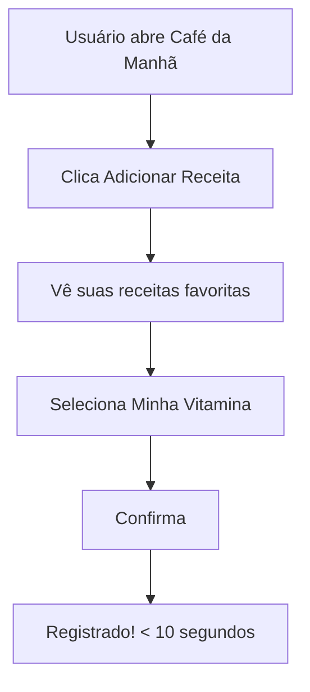
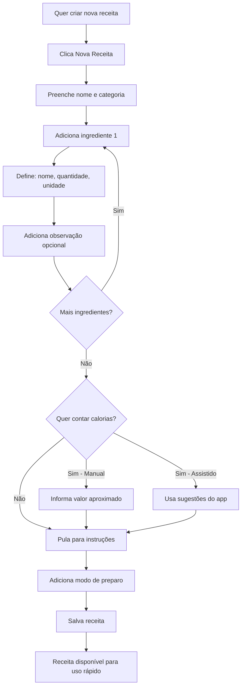
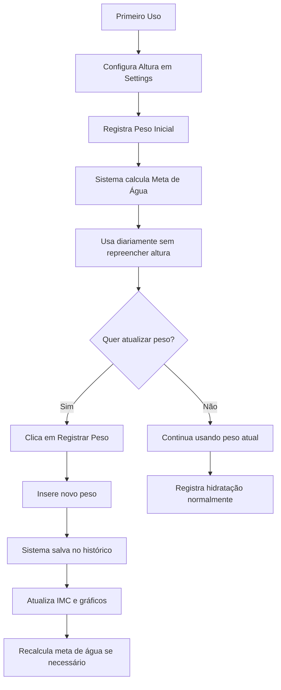
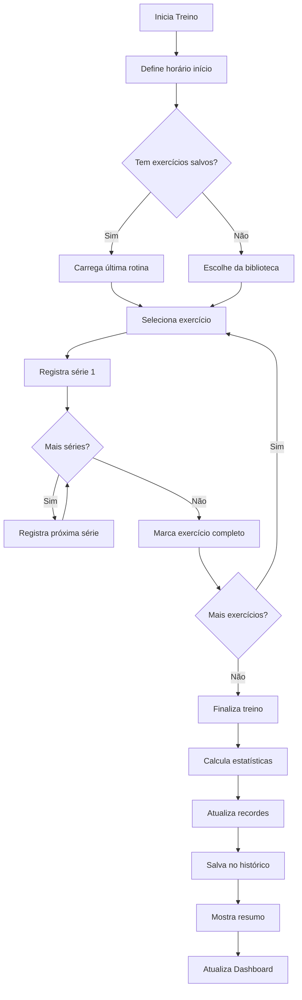
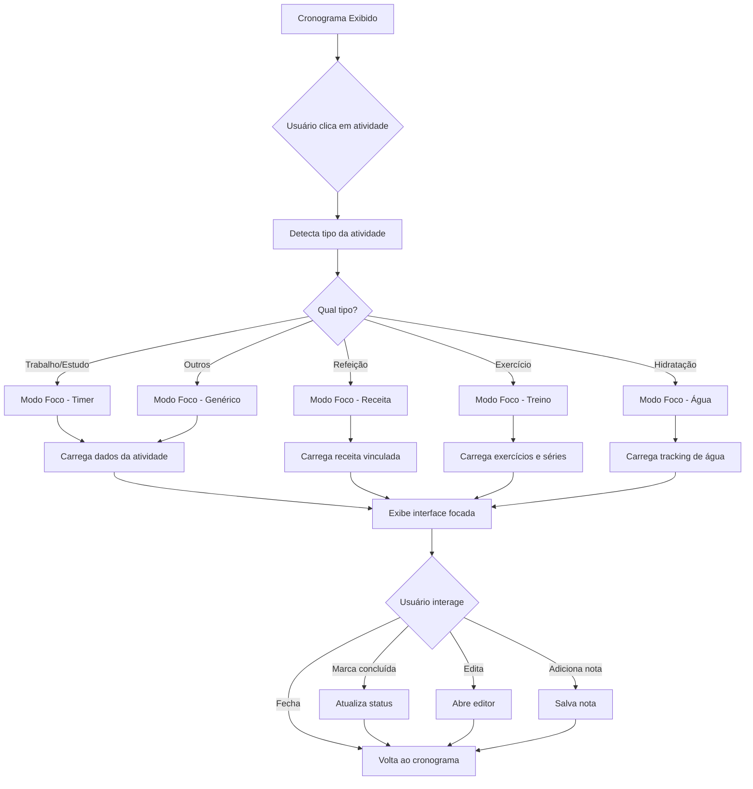

# 📋 Estratégia de Melhorias - Sistema de Saúde e Bem-Estar

> Documento de planejamento para expansão das funcionalidades de saúde (Alimentação, Hidratação e Exercícios)

**Data:** 15 de novembro de 2025  
**Versão:** 2.0 - **SIMPLIFICADA** 🎯

---

## 📌 Visão Geral

Este documento detalha a estratégia para implementar um sistema **PRÁTICO E SIMPLES** de acompanhamento de saúde, focando em três pilares:

1. **🍽️ Alimentação - Receitas Práticas (sem balança)**
2. **💧 Hidratação - Histórico de Peso**
3. **💪 Exercícios - Registro de Performance**

**Filosofia:** PRATICIDADE > PRECISÃO

---

## 🎯 Objetivos (Revistos)

### Gerais

- **Tornar o sistema RÁPIDO e FÁCIL de usar** ⚡
- **Reduzir fricção** - usuário não precisa de balança
- **Personalização** - receitas e hábitos do próprio usuário
- **Calorias opcionais** - só se quiser
- Fornecer métricas úteis (mas não obrigatórias)

### Específicos

- ✅ Implementar sistema de **receitas do usuário** (medidas práticas)
- ✅ Calorias **opcionais** (não forçadas)
- ✅ Criar histórico de peso com evolução
- ✅ Mover altura para configurações (uma vez só)
- ✅ Sistema de exercícios com registro de performance
- ❌ **REMOVIDO:** APIs de alimentos, busca de ingredientes, conversões complexas

**Economia:** ~4 semanas de desenvolvimento removendo complexidade desnecessária

---

## 🍽️ 1. ALIMENTAÇÃO - Sistema de Calorias

### 1.1 Situação Atual

```javascript
// Atual: meals.js
- Configuração de refeições (nome e descrição)
- Contador simples de refeições
- Sem controle de calorias
- Sem informações nutricionais
```

### 1.2 Proposta de Melhoria

#### **Sistema de Receitas do Usuário (RECOMENDADO)**

**Justificativa:**

- **Foco na PRATICIDADE**: Usuário não precisa pesar comida todo dia
- **Receitas pessoais**: Sistema aprende com os hábitos do usuário
- **Medidas do dia a dia**: colheres, xícaras, unidades - sem balança
- **Cálculo assistido**: App ajuda a calcular calorias totais
- **Opcional pesar**: Balança só se o usuário quiser mais precisão
- Rápido de usar: Reutilizar receitas favoritas em segundos

**Estrutura:**

```javascript
{
  userProfile: {
    dailyCaloriesGoal: 2000, // Meta diária configurável (opcional)
    height: 175,
    currentWeight: 70,
    trackCalories: false // Padrão: usuário não quer contar calorias
  },

  // FOCO: Receitas do Usuário
  userRecipes: [
    {
      id: "recipe_001",
      name: "Minha Vitamina Matinal",
      category: "breakfast",
      icon: "🥤",
      createdAt: "2025-11-15",

      // Ingredientes com MEDIDAS PRÁTICAS
      ingredients: [
        {
          name: "Banana",
          quantity: 2,
          unit: "unidades", // SEM gramas!
          notes: "Bananas médias"
        },
        {
          name: "Aveia",
          quantity: 5,
          unit: "colheres de sopa",
          notes: "" // Usuário não precisa saber que são 75g
        },
        {
          name: "Iogurte natural",
          quantity: 1,
          unit: "copo", // ou "200ml" se preferir
          notes: "Copo americano"
        },
        {
          name: "Água",
          quantity: 300,
          unit: "ml",
          notes: "Ou 1 copo e meio"
        },
        {
          name: "Açúcar",
          quantity: 2,
          unit: "colheres de sopa",
          notes: "Pode substituir por mel"
        }
      ],

      // CALORIAS OPCIONAIS
      // Usuário escolhe se quer calcular ou não
      nutritionTracking: {
        enabled: true, // Usuário ativou

        // Se ativado, usuário informa valores ESTIMADOS
        // Pode usar referências do app ou pesquisar
        estimatedCalories: 700, // Valor aproximado que o usuário informou
        estimatedProtein: 20,
        estimatedCarbs: 130,
        estimatedFat: 12,

        // Ou deixa o app calcular baseado em médias
        autoCalculated: false
      },

      instructions: "Bater tudo no liquidificador",
      preparationTime: 5, // minutos
      servings: 1,
      tags: ["rápido", "café da manhã", "favorita"],
      isFavorite: true,
      timesUsed: 24,
      lastUsed: "2025-11-15"
    },

    {
      id: "recipe_002",
      name: "Almoço Simples",
      category: "lunch",
      icon: "🍛",

      ingredients: [
        {
          name: "Arroz",
          quantity: 2,
          unit: "conchas", // Medida prática!
          notes: "Concha média de servir"
        },
        {
          name: "Feijão",
          quantity: 1,
          unit: "concha",
          notes: ""
        },
        {
          name: "Frango grelhado",
          quantity: 1,
          unit: "filé",
          notes: "Filé médio"
        },
        {
          name: "Salada",
          quantity: 1,
          unit: "prato",
          notes: "Prato de sobremesa cheio"
        }
      ],

      // Usuário NÃO quer contar calorias dessa
      nutritionTracking: {
        enabled: false
      },

      tags: ["almoço", "completo"],
      isFavorite: true
    }
  ],

  // Histórico de refeições (simples!)
  mealHistory: {
    "2025-11-15": {
      breakfast: {
        recipeId: "recipe_001",
        recipeName: "Minha Vitamina Matinal",
        time: "08:30",
        calories: 700 // só se usuário habilitou tracking
      },
      lunch: {
        recipeId: "recipe_002",
        recipeName: "Almoço Simples",
        time: "12:30"
        // sem calorias pois tracking desabilitado
      },

      // Totais do dia (opcional)
      dailyCalories: 700, // soma apenas receitas com tracking
      trackedMeals: 1, // quantas foram rastreadas
      totalMeals: 2
    }
  }
}
```

#### **APIs Sugeridas:**

**NÃO USAR APIs de alimentos!**

**Motivo:** O usuário não quer ficar pesquisando e medindo alimentos individuais.

**Alternativa:**

- Sistema 100% focado em **receitas pessoais do usuário**
- **Tabela de referência opcional** para quem quiser calcular calorias
- Valores aproximados e práticos
- Sem complexidade de APIs externas

**Se o usuário quiser calcular calorias:**

1. **Modo Manual**: Usuário informa valor aproximado total

   ```
   "Minha vitamina tem umas 700 calorias"
   ```

2. **Modo Assistido** (Opcional): App oferece valores médios de referência

   ```
   Banana média = ~100 cal
   Colher sopa aveia = ~60 cal
   Copo iogurte = ~100 cal
   ```

   Usuário soma mentalmente ou deixa app calcular

3. **Modo Ignorar**: Usuário só registra que comeu, sem calorias
   ```
   "Tomei minha vitamina" ✓
   ```

### 1.3 Interface Proposta

```
📱 Tela de Refeição - SIMPLES
┌─────────────────────────────────────┐
│ ☀️ Café da Manhã - 08:30           │
│                                     │
│ [➕ Adicionar Receita]              │
│ [� Nova Receita]                   │
│                                     │
│ ✅ Hoje você comeu:                 │
│ ┌─────────────────────────────────┐│
│ │ 🥤 Minha Vitamina Matinal       ││
│ │ ~700 cal                        ││
│ │ [ Remover]                    ││
│ └─────────────────────────────────┘│
│                                     │
│ 💡 Dica: Crie suas receitas         │
│    favoritas para registrar         │
│    rapidamente!                     │
└─────────────────────────────────────┘

🥘 Criar Receita - PRÁTICO
┌─────────────────────────────────────┐
│ 🥤 Nova Receita                     │
│                                     │
│ Nome: [Minha Vitamina Matinal]      │
│ Categoria: [Café da Manhã ▼]       │
│ Ícone: [🥤 ▼]                       │
│                                     │
│ 📋 Ingredientes (medidas práticas): │
│                                     │
│ ┌─────────────────────────────────┐│
│ │ Ingrediente: [Banana]           ││
│ │ Quantidade: [2] [unidades ▼]    ││
│ │ Obs: [médias]             [🗑]  ││
│ └─────────────────────────────────┘│
│                                     │
│ ┌─────────────────────────────────┐│
│ │ Ingrediente: [Aveia]            ││
│ │ Quantidade: [5] [colheres sopa▼]││
│ │ Obs: []                   [🗑]  ││
│ └─────────────────────────────────┘│
│                                     │
│ ┌─────────────────────────────────┐│
│ │ Ingrediente: [Iogurte natural]  ││
│ │ Quantidade: [1] [copo ▼]        ││
│ │ Obs: [copo americano]     [🗑]  ││
│ └─────────────────────────────────┘│
│                                     │
│ ┌─────────────────────────────────┐│
│ │ Ingrediente: [Água]             ││
│ │ Quantidade: [300] [ml ▼]        ││
│ │ Obs: [ou 1 copo e meio]   [🗑]  ││
│ └─────────────────────────────────┘│
│                                     │
│ ┌─────────────────────────────────┐│
│ │ Ingrediente: [Açúcar]           ││
│ │ Quantidade: [2] [colheres sopa▼]││
│ │ Obs: [pode ser mel]       [🗑]  ││
│ └─────────────────────────────────┘│
│                                     │
│ ➕ [Adicionar Ingrediente]          │
│                                     │
│ ┌─────────────────────────────────┐│
│ │ ⚙️ Calorias (opcional)          ││
│ │                                 ││
│ │ [ ] Não quero contar calorias   ││
│ │ [✓] Quero estimar calorias      ││
│ │                                 ││
│ │ � Calorias totais (aprox):     ││
│ │ [700] kcal                      ││
│ │                                 ││
│ │ 💡 Ajuda:                       ││
│ │ • Banana média: ~100 cal        ││
│ │ • Col. sopa aveia: ~60 cal      ││
│ │ • Copo iogurte: ~100 cal        ││
│ │ • Açúcar col. sopa: ~40 cal     ││
│ │ [Calcular Automaticamente]      ││
│ └─────────────────────────────────┘│
│                                     │
│ 📝 Modo de Preparo:                 │
│ [Bater tudo no liquidificador]      │
│                                     │
│ ⏱️ Tempo: [5] minutos               │
│ 🏷️ Tags: [rápido] [favorita]       │
│ ⭐ [Marcar como Favorita]           │
│                                     │
│ [Cancelar]  [Salvar Receita]       │
└─────────────────────────────────────┘

📚 Minhas Receitas
┌─────────────────────────────────────┐
│ 🥘 Minhas Receitas                  │
│                                     │
│ 🔍 Buscar: [________]               │
│                                     │
│ ⭐ Favoritas                        │
│ ┌─────────────────────────────────┐│
│ │ 🥤 Minha Vitamina Matinal       ││
│ │ ~700 cal • 5 min                ││
│ │ Usado 24x • Última: Hoje        ││
│ │ [➕ Usar] [📝 Editar]            ││
│ └─────────────────────────────────┘│
│                                     │
│ ┌─────────────────────────────────┐│
│ │ 🍛 Meu Almoço Simples           ││
│ │ Sem contagem de calorias        ││
│ │ Usado 18x • Última: Ontem       ││
│ │ [➕ Usar] [📝 Editar]            ││
│ └─────────────────────────────────┘│
│                                     │
│ 📂 Café da Manhã (3)                │
│ 📂 Almoço (5)                       │
│ 📂 Jantar (4)                       │
│ 📂 Lanches (2)                      │
│                                     │
│ [➕ Criar Nova Receita]             │
└─────────────────────────────────────┘

📊 Dashboard (Simplificado)
┌─────────────────────────────────────┐
│ � Resumo da Semana                 │
│                                     │
│ 🍽️ Refeições registradas: 18       │
│ ⭐ Receita mais usada:              │
│    Minha Vitamina Matinal (5x)      │
│                                     │
│ 🔥 Calorias (se habilitado):        │
│   • Média diária: ~1850 cal         │
│   • Meta: 2000 cal                  │
│                                     │
│ 💡 Você é mais consistente no       │
│    café da manhã!                   │
└─────────────────────────────────────┘
```

### 1.4 Fluxo de Trabalho

#### Fluxo Principal: Usar Receita Existente (Ultra-Rápido)



#### Fluxo Completo: Criar Nova Receita



### 1.5 Estrutura de Arquivos (Simplificada)

```
js/categories/meals.js (expandir)
js/nutrition/
  ├── recipe-manager.js       # Gerenciamento de receitas do usuário
  ├── calorie-helper.js       # OPCIONAL: Ajuda com estimativas
  └── nutrition-goals.js      # OPCIONAL: Metas (se usuário quiser)

data/
  └── calorie-reference.json  # OPCIONAL: Valores médios para ajuda
                              # (banana ~100cal, col aveia ~60cal, etc)

components/nutrition/
  ├── recipe-creator.html     # Criar/Editar receita
  ├── recipe-library.html     # Biblioteca de receitas
  ├── meal-tracker.html       # Tela de refeição (simples)
  └── nutrition-dashboard.html # Dashboard (opcional, se tracking habilitado)

css/nutrition/
  ├── recipe-creator.css
  ├── recipe-library.css
  └── meal-tracker.css
```

**NÃO PRECISA:**

- ❌ `food-api.js` - Sem integração com APIs externas
- ❌ `food-database.js` - Sem banco de alimentos
- ❌ `food-search.html` - Usuário não busca alimentos
- ❌ `unit-converter.js` - Conversões são opcionais e simples
- ❌ `macro-calculator.js` - Cálculos complexos opcionais

### 1.6 Recursos do Sistema (Focado em Praticidade)

#### Unidades de Medida Práticas:

```javascript
const PRACTICAL_UNITS = [
  // Sem gramas! Apenas medidas do dia a dia
  "unidades",
  "colheres de sopa",
  "colheres de chá",
  "xícaras",
  "copos",
  "conchas",
  "fatias",
  "filés",
  "porções",
  "pratos",
  "ml", // só quando faz sentido (água, leite)
];
```

#### Tabela de Referência OPCIONAL:

```javascript
// Apenas para AJUDAR o usuário se ele quiser
// Não é obrigatório usar!
const CALORIE_REFERENCE = {
  "Banana média": "~100 cal",
  "Colher sopa aveia": "~60 cal",
  "Colher sopa açúcar": "~40 cal",
  "Copo leite": "~150 cal",
  "Copo iogurte": "~100 cal",
  "Ovo unidade": "~70 cal",
  "Colher sopa azeite": "~120 cal",
  "Filé frango": "~150-200 cal",
  "Concha arroz": "~100 cal",
  "Concha feijão": "~80 cal",
  "Fatia pão": "~70 cal",
  // ... mais alguns comuns
};
```

#### Funcionalidades Principais:

1. **Criar receita rapidamente** (< 5 min)

   - Nome, ingredientes com medidas práticas
   - Modo de preparo
   - Calorias opcional

2. **Reusar receitas** (< 10 segundos)

   - Lista de favoritas
   - Um clique para adicionar

3. **Calorias flexível**

   ```
   Opção 1: "Não quero contar" ✓
   Opção 2: "Eu estimo ~700 cal"
   Opção 3: "App me ajuda a calcular"
   ```

4. **Histórico simples**

   - O que comeu e quando
   - Estatísticas básicas (receitas mais usadas)

5. **Sem balança obrigatória**
   - Tudo em medidas caseiras
   - Precisão não é o foco
   - Praticidade é prioridade

---

## 🍽️ 1.7 Casos de Uso Reais - Sistema Prático

### Caso 1: Criar Vitamina (Primeira Vez)

**Cenário:** Usuário quer cadastrar sua vitamina matinal

**Passos:**

1. Clica em "Nova Receita"
2. Preenche:

   - Nome: "Minha Vitamina Matinal"
   - Categoria: Café da Manhã
   - Ícone: 🥤

3. Adiciona ingredientes **SEM BALANÇA:**

   - Banana: 2 unidades (obs: médias)
   - Aveia: 5 colheres de sopa
   - Iogurte: 1 copo (obs: copo americano)
   - Água: 300ml (obs: ou 1 copo e meio)
   - Açúcar: 2 colheres de sopa (obs: pode ser mel)

4. **Calorias (OPCIONAL):**

   - Marca: "Quero estimar calorias"
   - Vê sugestões do app:
     - Banana média: ~100 cal (x2 = 200)
     - Col. sopa aveia: ~60 cal (x5 = 300)
     - Copo iogurte: ~100 cal
     - Açúcar col. sopa: ~40 cal (x2 = 80)
   - Digita: **~700 cal** (valor aproximado)

5. Modo de preparo: "Bater tudo no liquidificador"
6. Marca como favorita ⭐
7. Salva - **PRONTO!**

**Próximas vezes (< 10 segundos):**

- Abre "Café da Manhã"
- Clica "Adicionar Receita"
- Seleciona "Minha Vitamina Matinal"
- Confirma → **REGISTRADO!**

---

### Caso 2: Usuário NÃO Quer Contar Calorias

**Cenário:** Só quer registrar o que come, sem números

**Passos:**

1. Cria receita "Meu Almoço Simples"
2. Ingredientes:

   - Arroz: 2 conchas
   - Feijão: 1 concha
   - Frango: 1 filé
   - Salada: 1 prato

3. **Calorias:** Marca "Não quero contar" ✓
4. Salva

**Resultado:**

- Receita salva
- Pode reusar rapidamente
- Dashboard mostra "Almoço registrado" sem calorias
- Sem pressão, sem complexidade

---

### Caso 3: Ajustar Receita (Sem Balança)

**Cenário:** Hoje fez a vitamina com 3 bananas em vez de 2

**Opção 1 - Não liga para precisão:**

- Usa a mesma receita normalmente
- "~700 cal" continua bom o suficiente

**Opção 2 - Quer ajustar:**

- Edita temporariamente: 2 → 3 bananas
- Ajusta calorias: 700 → 800 cal
- Ou cria variação: "Vitamina Reforçada"

---

## 🍽️ 1.8 Exemplos de Outras Receitas

### Receita 2: Omelete Completo

**Ingredientes (sem balança):**

- 3 ovos
- 1 tomate médio picado
- 1/2 cebola
- Queijo: 3 colheres de sopa ralado
- Azeite: 1 colher de sopa
- Sal e pimenta

**Calorias (opcional):** ~420 cal _(usuário pode ignorar)_

**Preparo:** Bater ovos, refogar cebola e tomate, adicionar ovos e queijo

---

### Receita 3: Salada Completa de Almoço

**Ingredientes (medidas práticas):**

- Alface: 1 prato fundo
- Tomate: 1 unidade média
- Cenoura ralada: 4 colheres de sopa
- Frango grelhado: 1 filé
- Azeite: 2 colheres de sopa

**Calorias (opcional):** ~380 cal _(só se usuário quiser)_

**Preparo:** Grelhar frango, montar salada, temperar

---

### Receita 4: Mingau de Aveia com Frutas

**Ingredientes (sem pesar):**

- Aveia: 1 xícara
- Leite: 1 copo e meio
- Banana: 1 unidade cortada
- Mel: 1 colher de sopa
- Canela: a gosto

**Calorias (opcional):** ~520 cal _(ajuda do app se quiser)_

**Preparo:** Cozinhar aveia com leite, adicionar banana e mel

---

### Receita 5: Sanduíche Natural

**Ingredientes (rápido):**

- Pão integral: 2 fatias
- Peito de peru: 3 fatias
- Queijo: 2 fatias
- Alface e tomate

**Calorias:** Usuário decide se quer rastrear ou não

**Preparo:** Montar e comer!

---

## �️ 1.9 Sistema de Tags e Filtros (Simples)

### Tags Automáticas (opcionais):

- **Por refeição:** #café, #almoço, #jantar, #lanche
- **Por rapidez:** #rápido (< 10min), #elaborado
- **Por preferência:** #favorita ⭐

### Tags do Usuário (se quiser):

- Pode criar: #fitness, #domingo, #prático, #conforto
- Totalmente opcional

### Filtros na Lista de Receitas:

```
📂 Minhas Receitas (82 receitas)

🔍 Buscar: [        ]

Filtros rápidos:
  ⭐ Favoritas (12)
  ⚡ Mais usadas (8)
  🕒 Recentes (5)

Por refeição:
  ☕ Café (24)
  🍽️ Almoço (31)
  🌙 Jantar (19)
  🥤 Lanche (8)

Especiais:
  ✓ Com calorias registradas (45)
  ○ Sem calorias (37)
```

**Objetivo:** Encontrar receitas rapidamente, sem complexidade

---

## 💧 2. HIDRATAÇÃO - Histórico de Peso

### 2.1 Situação Atual

```javascript
// Atual: hydration.js
- Usuário preenche peso/altura todo dia
- Dados armazenados em userProfile (sobrescreve)
- Altura salva repetidamente
- Sem histórico de peso
```

### 2.2 Proposta de Melhoria

#### **Mudanças:**

1. **Altura → Configurações Gerais** (única vez)
2. **Peso → Histórico com Data**
3. **Dashboard de Evolução de Peso**

**Nova Estrutura:**

```javascript
{
  userProfile: {
    height: 175, // Configurado uma vez em Settings
    dailyWaterGoal: 2450, // Calculado uma vez
    gender: "male", // Opcional: ajuda no cálculo
    birthDate: "1990-01-15", // Opcional: para metas por idade
    activityLevel: "moderate" // Opcional: ajusta necessidade de água
  },

  weightHistory: [
    {
      id: "weight_001",
      date: "2025-11-01",
      weight: 72.5,
      bmi: 23.7,
      registeredAt: "2025-11-01T08:30:00",
      note: "Após café da manhã" // Opcional
    },
    {
      id: "weight_002",
      date: "2025-11-08",
      weight: 71.8,
      bmi: 23.4,
      registeredAt: "2025-11-08T08:15:00"
    },
    {
      id: "weight_003",
      date: "2025-11-15",
      weight: 71.2,
      bmi: 23.2,
      registeredAt: "2025-11-15T08:20:00"
    }
  ],

  hydrationTracking: {
    "2025-11-15": {
      goal: 2450, // ml
      consumed: 1800,
      remaining: 650,
      percentage: 73.5,
      weight: 71.2, // Referência ao peso atual
      logs: [
        { time: "08:30", amount: 300 },
        { time: "10:00", amount: 500 },
        { time: "14:30", amount: 500 },
        { time: "18:00", amount: 500 }
      ]
    }
  }
}
```

### 2.3 Interface Proposta

```
⚙️ Configurações Gerais (Nova Seção)
┌─────────────────────────────────────┐
│ 📏 Dados Físicos                    │
│                                     │
│ Altura: [175] cm                    │
│ Sexo: (•) M  ( ) F  ( ) Outro      │
│ Data Nasc: [15/01/1990]            │
│ Nível Atividade:                    │
│   [Moderado ▼]                      │
│                                     │
│ ⚖️ Peso Atual: 71.2 kg              │
│ 📅 Última atualização: Hoje 08:20   │
│                                     │
│ [📝 Registrar Novo Peso]            │
│ [📊 Ver Histórico Completo]         │
└─────────────────────────────────────┘

⚖️ Modal de Registro de Peso
┌─────────────────────────────────────┐
│ 📝 Registrar Peso                   │
│                                     │
│ Data: [15/11/2025]                  │
│ Peso: [____] kg                     │
│                                     │
│ 📝 Observação (opcional):           │
│ [________________________]          │
│                                     │
│ Último peso: 71.8 kg (há 7 dias)    │
│                                     │
│ [Cancelar]  [Salvar Peso]          │
└─────────────────────────────────────┘

💧 Tela de Hidratação (Simplificada)
┌─────────────────────────────────────┐
│ 💧 Hidratação - 15/11/2025          │
│                                     │
│ 🎯 Meta: 2450 ml (2.45 L)           │
│ ✅ Consumido: 1800 ml (73.5%)       │
│                                     │
│ ┌─────────────────────────────────┐│
│ │ 💧💧💧💧💧💧💧░░░               ││
│ └─────────────────────────────────┘│
│                                     │
│ 📊 Registrar Consumo:               │
│ [250ml] [500ml] [750ml] [Custom]    │
│                                     │
│ ⚖️ Peso atual: 71.2 kg (IMC: 23.2)  │
│ [📝 Atualizar Peso]                 │
└─────────────────────────────────────┘

📊 Dashboard de Evolução de Peso
┌─────────────────────────────────────┐
│ 📈 Evolução de Peso (3 meses)       │
│                                     │
│  73|●                               │
│  72|  ●                             │
│  71|    ●──●                        │
│  70|        ╲ ●                     │
│     └──Nov──Dez──Jan──Fev          │
│                                     │
│ 📊 Estatísticas:                    │
│   Peso Inicial: 72.5 kg             │
│   Peso Atual: 71.2 kg               │
│   Variação: -1.3 kg (-1.8%)         │
│   IMC: 23.2 (Peso Normal)           │
│   Meta: 70 kg                       │
│   Faltam: 1.2 kg                    │
│                                     │
│ 🎯 Tendência: Perda gradual saudável│
│    (0.4 kg/mês em média)            │
└─────────────────────────────────────┘
```

### 2.4 Fluxo de Trabalho



### 2.5 Estrutura de Arquivos

```
js/categories/hydration.js (simplificar)
js/health/
  ├── weight-tracker.js        # Gerencia histórico de peso
  ├── bmi-calculator.js        # Cálculo de IMC
  ├── weight-goals.js          # Metas de peso
  └── water-calculator.js      # Cálculo de necessidade de água

js/settings/
  └── user-profile.js          # Configurações gerais (altura, etc)

components/health/
  ├── weight-registration.html # Modal de registro
  ├── weight-dashboard.html    # Dashboard de evolução
  └── settings-profile.html    # Configurações gerais

css/health/
  ├── weight-tracker.css
  └── weight-dashboard.css
```

---

## 💪 3. EXERCÍCIOS - Sistema de Performance

### 3.1 Situação Atual

```javascript
// Atual: exercise.js
- Apenas horário de exercício
- Tipo genérico de exercício
- Sem registro de atividades específicas
- Sem métricas de evolução
```

### 3.2 Proposta de Melhoria

#### **Novo Sistema:**

1. **Biblioteca de Exercícios**
2. **Registro de Séries e Repetições**
3. **Histórico e Evolução**
4. **Dashboard de Performance**

**Estrutura:**

```javascript
{
  exerciseLibrary: {
    strength: [
      {
        id: "ex_001",
        name: "Flexão",
        category: "strength",
        muscleGroup: ["peito", "tríceps", "ombros"],
        difficulty: "beginner",
        description: "Flexão de braço tradicional",
        icon: "💪"
      },
      {
        id: "ex_002",
        name: "Barra Fixa",
        category: "strength",
        muscleGroup: ["costas", "bíceps"],
        difficulty: "intermediate",
        description: "Pull-up na barra",
        icon: "🏋️"
      },
      {
        id: "ex_003",
        name: "Agachamento",
        category: "strength",
        muscleGroup: ["pernas", "glúteos"],
        difficulty: "beginner",
        description: "Agachamento livre",
        icon: "🦵"
      }
    ],
    cardio: [
      {
        id: "ex_101",
        name: "Corrida",
        category: "cardio",
        unit: "km",
        icon: "🏃"
      }
    ]
  },

  workoutHistory: {
    "2025-11-15": {
      workoutId: "workout_001",
      startTime: "07:00",
      endTime: "08:00",
      duration: 60,
      type: "strength",

      exercises: [
        {
          exerciseId: "ex_001",
          name: "Flexão",
          sets: [
            { set: 1, reps: 15, weight: 0, completed: true },
            { set: 2, reps: 12, weight: 0, completed: true },
            { set: 3, reps: 10, weight: 0, completed: true }
          ],
          totalReps: 37,
          notes: "Senti dificuldade na última série"
        },
        {
          exerciseId: "ex_002",
          name: "Barra Fixa",
          sets: [
            { set: 1, reps: 8, weight: 0, completed: true },
            { set: 2, reps: 6, weight: 0, completed: true },
            { set: 3, reps: 5, weight: 0, completed: false }
          ],
          totalReps: 14
        },
        {
          exerciseId: "ex_003",
          name: "Agachamento",
          sets: [
            { set: 1, reps: 20, weight: 0, completed: true },
            { set: 2, reps: 18, weight: 0, completed: true },
            { set: 3, reps: 15, weight: 0, completed: true }
          ],
          totalReps: 53
        }
      ],

      totalExercises: 3,
      completedExercises: 2,
      completionRate: 66.67,
      caloriesBurned: 320 // Estimativa
    }
  },

  personalRecords: {
    "ex_001": { // Flexão
      maxReps: 15,
      date: "2025-11-15",
      totalSessions: 24,
      totalReps: 856
    },
    "ex_002": { // Barra
      maxReps: 8,
      date: "2025-11-15",
      totalSessions: 18,
      totalReps: 312
    }
  },

  exerciseGoals: {
    "ex_001": {
      currentMax: 15,
      goalMax: 30,
      targetDate: "2025-12-31"
    }
  }
}
```

### 3.3 Interface Proposta

```
💪 Tela de Exercício
┌─────────────────────────────────────┐
│ 💪 Treino - 15/11/2025              │
│                                     │
│ ⏰ Duração: 00:45:30                │
│ 🔥 Calorias: ~280 kcal              │
│                                     │
│ 📋 Exercícios de Hoje:              │
│                                     │
│ ┌─────────────────────────────────┐│
│ │ 💪 Flexão                       ││
│ │ ✅ 3 séries • 37 reps total     ││
│ │ 🏆 Recorde: 15 reps             ││
│ │ [Ver Detalhes]                  ││
│ └─────────────────────────────────┘│
│                                     │
│ ┌─────────────────────────────────┐│
│ │ 🏋️ Barra Fixa                   ││
│ │ ⚠️ 2/3 séries • 14 reps         ││
│ │ 🎯 Próximo: 8 reps              ││
│ │ [Continuar]                     ││
│ └─────────────────────────────────┘│
│                                     │
│ ➕ [Adicionar Exercício]            │
│                                     │
│ [Finalizar Treino] [Ver Evolução]  │
└─────────────────────────────────────┘

📝 Registro de Exercício
┌─────────────────────────────────────┐
│ 💪 Flexão                           │
│                                     │
│ Série 1: [15] reps  ✅              │
│ Série 2: [12] reps  ✅              │
│ Série 3: [10] reps  ✅              │
│                                     │
│ ➕ [Adicionar Série]                │
│                                     │
│ 📝 Observações:                     │
│ [________________________]          │
│                                     │
│ 🏆 Seu recorde: 15 reps             │
│ 📊 Média últimas 7 sessões: 13 reps │
│                                     │
│ [Voltar]  [Salvar]                 │
└─────────────────────────────────────┘

📊 Dashboard de Evolução
┌─────────────────────────────────────┐
│ 📈 Evolução - Flexão                │
│                                     │
│ Máximo por Sessão (últimas 8)       │
│  16|              ●                 │
│  14|        ●   ●                   │
│  12|    ●                           │
│  10|  ●                             │
│     └──────────────────────         │
│                                     │
│ 🏆 Recordes Pessoais:               │
│   Máximo: 15 reps (15/11/2025)      │
│   Total: 856 reps (24 treinos)      │
│   Média: 35.7 reps/treino           │
│                                     │
│ 📊 Estatísticas do Mês:             │
│   Treinos: 12                       │
│   Total reps: 420                   │
│   Evolução: +18% vs mês anterior    │
│                                     │
│ 🎯 Meta: 30 reps até 31/12          │
│   Faltam: 15 reps (50% alcançado)   │
└─────────────────────────────────────┘

📚 Biblioteca de Exercícios
┌─────────────────────────────────────┐
│ 💪 Força  🏃 Cardio  🧘 Flexibilidade│
│                                     │
│ 🔍 Pesquisar: [____________]        │
│                                     │
│ ┌─────────────────────────────────┐│
│ │ 💪 Flexão                       ││
│ │ Peito, Tríceps, Ombros          ││
│ │ ⭐ Iniciante                    ││
│ │ Usado 24x                       ││
│ └─────────────────────────────────┘│
│                                     │
│ ┌─────────────────────────────────┐│
│ │ 🏋️ Barra Fixa                   ││
│ │ Costas, Bíceps                  ││
│ │ ⭐⭐ Intermediário              ││
│ │ Usado 18x                       ││
│ └─────────────────────────────────┘│
│                                     │
│ ➕ [Criar Exercício Personalizado]  │
└─────────────────────────────────────┘
```

### 3.4 Fluxo de Trabalho



### 3.5 Estrutura de Arquivos

```
js/categories/exercise.js (expandir)
js/exercise/
  ├── exercise-library.js      # Biblioteca de exercícios
  ├── workout-tracker.js       # Tracking de treino
  ├── sets-reps-manager.js     # Gerencia séries/reps
  ├── personal-records.js      # Recordes pessoais
  ├── workout-stats.js         # Estatísticas
  └── calorie-estimator.js     # Estimativa de calorias

data/
  └── exercises-database.json  # Base de exercícios

components/exercise/
  ├── exercise-library.html    # Biblioteca
  ├── workout-tracker.html     # Tela de treino
  ├── exercise-form.html       # Registro de séries
  ├── workout-summary.html     # Resumo pós-treino
  └── exercise-dashboard.html  # Dashboard evolução

css/exercise/
  ├── exercise-cards.css
  ├── workout-tracker.css
  └── exercise-dashboard.css
```

---

## � 4. MODO FOCO - Detalhamento de Atividades

### 4.1 Visão Geral

**Problema atual:** Atividades no cronograma aparecem de forma compacta, sem detalhes ou interatividade individual.

**Solução:** Implementar **Modo Foco** - ao clicar em qualquer atividade, abre uma visualização detalhada e focada com:
- Informações completas da atividade
- Temporizador/contador em destaque
- Ações específicas por tipo de atividade
- Notas e contexto
- Integração com novas funcionalidades (receitas, exercícios, etc)

### 4.2 Estrutura de Dados

```javascript
{
  focusMode: {
    active: false,
    activityId: null,
    scheduleDate: null,
    activityIndex: null,
    
    // Dados da atividade em foco
    activityData: {
      id: "work-0",
      type: "work",
      name: "💼 Trabalho Remoto",
      startTime: "09:00",
      endTime: "12:00",
      description: "Reunião de sprint e desenvolvimento",
      
      // Dados específicos por tipo
      typeSpecificData: {
        // Para trabalho/estudo
        project: "Sistema de Saúde v2.0",
        tasks: ["Implementar modo foco", "Testar funcionalidades"],
        
        // Para refeição
        recipeId: "recipe_001",
        recipeName: "Minha Vitamina Matinal",
        
        // Para exercício
        exerciseIds: ["ex_001", "ex_002"],
        sets: [...],
        
        // Para hidratação
        waterGoal: 2450,
        consumed: 1800
      },
      
      // Tracking
      simpleTracking: {
        status: null, // 'complete', 'incomplete', null
        completedAt: null,
        notes: ""
      },
      
      // Timer info
      isActive: true,
      timeRemaining: "1h 23min",
      progress: 45 // percentual
    }
  }
}
```

### 4.3 Interface do Modo Foco

```
📱 Modo Foco - Trabalho
┌─────────────────────────────────────┐
│ [← Voltar]              [✕ Fechar] │
│                                     │
│ ┌─────────────────────────────────┐│
│ │                                 ││
│ │       💼 TRABALHO REMOTO        ││
│ │                                 ││
│ │     ⏰ 09:00 - 12:00 (3h)       ││
│ │                                 ││
│ │   ⏳ Tempo restante: 1h 23min   ││
│ │                                 ││
│ │ ▓▓▓▓▓▓▓▓▓▓▓▓▓░░░░░░░░░░░░░░    ││
│ │         45% concluído            ││
│ │                                 ││
│ └─────────────────────────────────┘│
│                                     │
│ 📋 Descrição:                       │
│ Reunião de sprint e desenvolvimento │
│                                     │
│ 🎯 Projeto:                         │
│ Sistema de Saúde v2.0               │
│                                     │
│ ✅ Tarefas:                         │
│ • Implementar modo foco             │
│ • Testar funcionalidades            │
│                                     │
│ 📝 Notas:                           │
│ [________________________]          │
│ [Adicionar Nota]                    │
│                                     │
│ 🔔 Notificações:                    │
│ [✓] Avisar 5 min antes do fim      │
│ [✓] Tocar som ao terminar           │
│                                     │
│ ⚙️ Ações:                           │
│ [✅ Marcar Concluída]               │
│ [❌ Marcar Não Feita]               │
│ [⏸️ Pausar Timer]                   │
│ [📝 Editar Atividade]               │
└─────────────────────────────────────┘

📱 Modo Foco - Refeição (com Receita)
┌─────────────────────────────────────┐
│ [← Voltar]              [✕ Fechar] │
│                                     │
│ ┌─────────────────────────────────┐│
│ │                                 ││
│ │    🥤 MINHA VITAMINA MATINAL    ││
│ │                                 ││
│ │     ⏰ Café da Manhã - 08:00    ││
│ │                                 ││
│ │      ~700 calorias              ││
│ │                                 ││
│ └─────────────────────────────────┘│
│                                     │
│ 📋 Ingredientes:                    │
│ • 2 bananas médias                  │
│ • 5 colheres de sopa de aveia      │
│ • 1 copo de iogurte natural        │
│ • 300ml de água                     │
│ • 2 colheres de sopa de açúcar     │
│                                     │
│ 👨‍🍳 Modo de Preparo:                 │
│ Bater tudo no liquidificador até    │
│ ficar homogêneo                     │
│                                     │
│ ⏱️ Tempo de preparo: 5 min          │
│                                     │
│ 🔥 Informações Nutricionais:        │
│ ┌─────────────────────────────────┐│
│ │ Calorias: 700 kcal              ││
│ │ Proteínas: 20.5g (12%)          ││
│ │ Carboidratos: 132g (75%)        ││
│ │ Gorduras: 11.9g (15%)           ││
│ └─────────────────────────────────┘│
│                                     │
│ 📝 Observações:                     │
│ [Estava deliciosa hoje!_______]    │
│                                     │
│ ⚙️ Ações:                           │
│ [✅ Marcar como Consumida]          │
│ [📝 Editar Receita]                 │
│ [📋 Copiar para Outro Dia]          │
└─────────────────────────────────────┘

📱 Modo Foco - Exercício
┌─────────────────────────────────────┐
│ [← Voltar]              [✕ Fechar] │
│                                     │
│ ┌─────────────────────────────────┐│
│ │                                 ││
│ │       💪 TREINO MATINAL         ││
│ │                                 ││
│ │     ⏰ 07:00 - 08:00 (1h)       ││
│ │                                 ││
│ │   ⏳ Em andamento: 32min         ││
│ │                                 ││
│ │ ▓▓▓▓▓▓▓▓▓▓▓░░░░░░░░░░░░░░░░    ││
│ │         53% concluído            ││
│ │                                 ││
│ └─────────────────────────────────┘│
│                                     │
│ 💪 Exercícios de Hoje:              │
│                                     │
│ ┌─────────────────────────────────┐│
│ │ 💪 Flexão                       ││
│ │ ✅ 3 séries completas           ││
│ │ Série 1: 15 reps                ││
│ │ Série 2: 12 reps                ││
│ │ Série 3: 10 reps                ││
│ │ Total: 37 reps                  ││
│ │ 🏆 Seu recorde: 15 reps         ││
│ └─────────────────────────────────┘│
│                                     │
│ ┌─────────────────────────────────┐│
│ │ 🏋️ Barra Fixa                   ││
│ │ ⏳ Em andamento (2/3 séries)    ││
│ │ Série 1: 8 reps ✅              ││
│ │ Série 2: 6 reps ✅              ││
│ │ Série 3: [_] reps 🎯            ││
│ │ [Registrar Série 3]             ││
│ └─────────────────────────────────┘│
│                                     │
│ ┌─────────────────────────────────┐│
│ │ 🦵 Agachamento                  ││
│ │ ⏸️ Pendente (0/3 séries)        ││
│ │ [Iniciar]                       ││
│ └─────────────────────────────────┘│
│                                     │
│ 📊 Resumo do Treino:                │
│ • Exercícios: 3 total               │
│ • Completos: 1                      │
│ • Em andamento: 1                   │
│ • Calorias estimadas: ~280 kcal     │
│                                     │
│ ⚙️ Ações:                           │
│ [▶️ Continuar Treino]               │
│ [✅ Finalizar Treino]               │
│ [➕ Adicionar Exercício]            │
└─────────────────────────────────────┘

📱 Modo Foco - Hidratação
┌─────────────────────────────────────┐
│ [← Voltar]              [✕ Fechar] │
│                                     │
│ ┌─────────────────────────────────┐│
│ │                                 ││
│ │     💧 HIDRATAÇÃO DIÁRIA        ││
│ │                                 ││
│ │        Meta: 2450ml             ││
│ │                                 ││
│ │     🥤 1800ml / 2450ml          ││
│ │         73.5%                   ││
│ │                                 ││
│ │ 💧💧💧💧💧💧💧💧░░░░░░░░░░      ││
│ │                                 ││
│ └─────────────────────────────────┘│
│                                     │
│ 📊 Faltam: 650ml (2.6 copos)        │
│                                     │
│ ⚡ Registrar Consumo Rápido:        │
│ ┌───────────────────────────────┐  │
│ │ [250ml] [500ml] [750ml]       │  │
│ │ [1 Copo] [1 Garrafa]          │  │
│ └───────────────────────────────┘  │
│                                     │
│ 🎯 Personalizado:                   │
│ [___] ml  [Adicionar]               │
│                                     │
│ 📝 Histórico de Hoje:               │
│ • 08:30 - 300ml (início do dia)     │
│ • 10:00 - 500ml (meio da manhã)     │
│ • 14:30 - 500ml (após almoço)       │
│ • 18:00 - 500ml (fim da tarde)      │
│                                     │
│ ⚖️ Seu Peso: 71.2 kg (IMC: 23.2)    │
│ [📝 Atualizar Peso]                 │
│                                     │
│ 💡 Dica: Beba 250ml agora para      │
│    atingir 75% da meta!             │
│                                     │
│ 🔔 Lembretes:                       │
│ [✓] Lembrar a cada 2 horas         │
│                                     │
│ ⚙️ Ações:                           │
│ [📊 Ver Evolução Semanal]           │
│ [⚙️ Ajustar Meta]                   │
└─────────────────────────────────────┘
```

### 4.4 Fluxo de Interação



### 4.5 Implementação Técnica

#### 4.5.1 Estrutura de Arquivos

```
js/focus-mode/
  ├── focus-manager.js         # Gerenciador principal do modo foco
  ├── focus-renderer.js        # Renderização das interfaces
  ├── focus-interactions.js    # Interações e eventos
  └── focus-types/
      ├── work-study-focus.js  # Foco para trabalho/estudo
      ├── meal-focus.js        # Foco para refeições (integra receitas)
      ├── exercise-focus.js    # Foco para exercícios (integra workouts)
      ├── hydration-focus.js   # Foco para hidratação
      └── generic-focus.js     # Foco genérico

components/focus-mode/
  ├── focus-overlay.html       # Overlay/modal principal
  ├── focus-timer.html         # Componente de timer
  ├── focus-actions.html       # Botões de ação
  └── focus-notes.html         # Área de notas

css/focus-mode/
  ├── focus-layout.css         # Layout geral do modo foco
  ├── focus-timer.css          # Estilo do timer
  ├── focus-cards.css          # Cards de conteúdo
  └── focus-responsive.css     # Responsividade
```

#### 4.5.2 API Principal

```javascript
// focus-manager.js

const FocusMode = {
  // Estado
  state: {
    active: false,
    activityId: null,
    scheduleDate: null,
    activityIndex: null,
    activityData: null
  },

  // Abrir modo foco
  open(scheduleDate, activityIndex) {
    const schedule = appState.userData.dailySchedules[scheduleDate];
    const activity = schedule.activities[activityIndex];
    
    this.state = {
      active: true,
      activityId: activity.id,
      scheduleDate: scheduleDate,
      activityIndex: activityIndex,
      activityData: activity
    };
    
    // Renderizar interface apropriada
    this.render();
    
    // Iniciar timer se necessário
    if (this.isActive()) {
      this.startTimer();
    }
  },

  // Fechar modo foco
  close() {
    this.stopTimer();
    this.state.active = false;
    this.hideOverlay();
    
    // Recarregar cronograma para mostrar atualizações
    showScheduleView();
  },

  // Renderizar interface
  render() {
    const type = this.state.activityData.type;
    const renderer = FocusRenderers[type] || FocusRenderers.generic;
    
    const html = renderer(this.state.activityData, this.state);
    document.getElementById('focus-mode-overlay').innerHTML = html;
    this.showOverlay();
  },

  // Verificar se atividade está ativa agora
  isActive() {
    const activity = this.state.activityData;
    const now = new Date();
    const todayKey = formatDateKey(now);
    
    // Apenas ativo se for hoje e dentro do horário
    return this.state.scheduleDate === todayKey &&
           isEventActive(activity.startTime, activity.endTime);
  },

  // Timer
  timerInterval: null,
  
  startTimer() {
    this.updateTimer();
    this.timerInterval = setInterval(() => this.updateTimer(), 1000);
  },
  
  stopTimer() {
    if (this.timerInterval) {
      clearInterval(this.timerInterval);
      this.timerInterval = null;
    }
  },
  
  updateTimer() {
    const activity = this.state.activityData;
    const remaining = getTimeRemaining(activity.endTime);
    
    // Atualizar UI
    const timerEl = document.getElementById('focus-timer');
    if (timerEl) {
      timerEl.textContent = remaining.text;
    }
    
    // Atualizar barra de progresso
    const progress = this.calculateProgress();
    const progressBar = document.getElementById('focus-progress-bar');
    if (progressBar) {
      progressBar.style.width = `${progress}%`;
    }
    
    // Notificação quando terminar
    if (remaining.minutes === 0 && remaining.seconds === 0) {
      this.onTimerComplete();
    }
  },
  
  calculateProgress() {
    const activity = this.state.activityData;
    const start = parseTimeToMinutes(activity.startTime);
    const end = parseTimeToMinutes(activity.endTime);
    const now = parseTimeToMinutes(getCurrentTime());
    
    return Math.round(((now - start) / (end - start)) * 100);
  },
  
  onTimerComplete() {
    this.stopTimer();
    
    // Notificação
    if ('Notification' in window && Notification.permission === 'granted') {
      new Notification('Atividade Concluída!', {
        body: `${this.state.activityData.name} terminou`,
        icon: '/icon-192.png'
      });
    }
    
    // Som (opcional)
    this.playCompletionSound();
  },
  
  // Ações
  markComplete() {
    markEventSimpleComplete(this.state.scheduleDate, this.state.activityIndex);
    this.close();
  },
  
  markIncomplete() {
    markEventSimpleIncomplete(this.state.scheduleDate, this.state.activityIndex);
    this.close();
  },
  
  addNote(note) {
    const schedule = appState.userData.dailySchedules[this.state.scheduleDate];
    const activity = schedule.activities[this.state.activityIndex];
    
    if (!activity.simpleTracking) {
      activity.simpleTracking = {};
    }
    activity.simpleTracking.notes = note;
    
    saveToStorage();
  },
  
  // Overlay
  showOverlay() {
    const overlay = document.getElementById('focus-mode-overlay');
    overlay.classList.add('active');
    document.body.style.overflow = 'hidden';
  },
  
  hideOverlay() {
    const overlay = document.getElementById('focus-mode-overlay');
    overlay.classList.remove('active');
    document.body.style.overflow = '';
  }
};

// Expor globalmente
window.FocusMode = FocusMode;
```

#### 4.5.3 Integração com Atividades

```javascript
// Modificar schedule-render.js para adicionar click handler

function renderActivity(schedule, activity, index, isToday) {
  // ... código existente ...
  
  // Adicionar atributo onclick para abrir modo foco
  const focusHandler = `onclick="FocusMode.open('${schedule.date}', ${index}); event.stopPropagation();"`;
  
  return `
    <div class="activity ${isActive ? 'active-event' : ''} ${statusClass}" 
         ${focusHandler}
         style="cursor: pointer;">
      <div class="activity-main">
        ${activityInfoHtml}
        ${actionsHtml}
      </div>
      ${countdownHtml}
      ${trackingInfo}
    </div>
  `;
}
```

### 4.6 Benefícios do Modo Foco

#### Para o Usuário:
- ✅ **Visão detalhada** de cada atividade
- ✅ **Timer em destaque** para atividades ativas
- ✅ **Acesso rápido** a receitas, exercícios, etc
- ✅ **Adicionar notas** e contexto
- ✅ **Marcar conclusão** de forma focada
- ✅ **Menos distração** - foco em uma atividade por vez

#### Para o Sistema:
- ✅ **Base para novas features** (receitas, exercícios)
- ✅ **Integração natural** com tracking detalhado
- ✅ **Extensível** - fácil adicionar novos tipos
- ✅ **Consistente** - mesmo padrão para todas atividades

### 4.7 Casos de Uso

#### Caso 1: Trabalho em Andamento
1. Usuário vê trabalho ativo no cronograma
2. Clica na atividade
3. Modo Foco abre com timer grande
4. Vê tempo restante: "1h 23min"
5. Adiciona nota: "Reunião produtiva"
6. Fecha e continua trabalhando

#### Caso 2: Hora da Refeição
1. Notificação: "Hora do café da manhã!"
2. Usuário abre cronograma
3. Clica na refeição
4. Modo Foco mostra receita completa
5. Vê ingredientes e modo de preparo
6. Marca como consumida
7. Opcional: Adiciona nota sobre sabor

#### Caso 3: Treino em Progresso
1. Usuário está treinando
2. Clica em "Exercício" no cronograma
3. Modo Foco abre
4. Registra séries em tempo real
5. Vê progresso: 2/3 exercícios completos
6. Finaliza treino quando termina

#### Caso 4: Lembrete de Hidratação
1. Sistema lembra: "Hora de beber água!"
2. Usuário clica em Hidratação
3. Modo Foco mostra progresso: 73.5%
4. Clica em "500ml"
5. Barra atualiza para 93.9%
6. Fecha satisfeito

### 4.8 Prioridade de Implementação

**Fase 0 (Base):** Antes das outras features
- [ ] Implementar estrutura básica do modo foco
- [ ] Timer e progresso visual
- [ ] Overlay/modal responsivo
- [ ] Integração com cronograma (click handlers)

**Fase 1 (Genérico):** Funciona com tudo
- [ ] Modo foco genérico (trabalho, estudo, etc)
- [ ] Marcação de conclusão
- [ ] Adicionar notas
- [ ] Notificações

**Fase 2 (Especializado):** Quando implementar receitas
- [ ] Modo foco para refeições
- [ ] Exibir receita completa
- [ ] Integração com sistema de calorias

**Fase 3 (Exercícios):** Quando implementar workout tracking
- [ ] Modo foco para exercícios
- [ ] Registro de séries em tempo real
- [ ] Progresso do treino

**Fase 4 (Hidratação):** Melhorar tracking
- [ ] Modo foco para hidratação
- [ ] Registro rápido de consumo
- [ ] Histórico do dia

---

## �🎨 5. DASHBOARD UNIFICADO

### 5.1 Expandir Dashboard Existente

```javascript
// Adicionar ao dashboard atual
{
  nutrition: {
    weeklyCalories: [...],
    averageCalories: 1850,
    goalCalories: 2000,
    adherence: 92.5,
    macros: {
      protein: 85,
      carbs: 230,
      fat: 58
    }
  },

  weight: {
    current: 71.2,
    initial: 72.5,
    change: -1.3,
    trend: "decreasing",
    weeklyChange: -0.3
  },

  exercise: {
    totalWorkouts: 12,
    totalReps: 856,
    topExercise: "Flexão",
    caloriesBurned: 3840,
    newRecords: 2
  }
}
```

### 5.2 Interface do Dashboard

```
📊 Dashboard de Saúde (Expandido)
┌───────────────────────────────────────────────┐
│ 🍽️ Alimentação                                │
│ ┌──────────────────────────────────────────┐ │
│ │ 📈 1850 cal/dia (média semanal)          │ │
│ │ 🎯 Meta: 2000 cal • 92.5% aderência      │ │
│ │                                           │ │
│ │ Macros: P:22% | C:50% | G:28%            │ │
│ └──────────────────────────────────────────┘ │
│                                               │
│ ⚖️ Peso e IMC                                 │
│ ┌──────────────────────────────────────────┐ │
│ │ 📉 71.2 kg (-1.3 kg no mês)              │ │
│ │ 💪 IMC: 23.2 (Peso Normal)               │ │
│ │ 🎯 Meta: 70 kg (faltam 1.2 kg)           │ │
│ └──────────────────────────────────────────┘ │
│                                               │
│ 💪 Exercícios                                 │
│ ┌──────────────────────────────────────────┐ │
│ │ 🏋️ 12 treinos no mês                     │ │
│ │ 🔥 3840 kcal queimadas                   │ │
│ │ 🏆 2 novos recordes pessoais!            │ │
│ │ ⭐ Mais praticado: Flexão (24x)          │ │
│ └──────────────────────────────────────────┘ │
│                                               │
│ 💧 Hidratação                                 │
│ ┌──────────────────────────────────────────┐ │
│ │ 🥤 2.1 L/dia (média semanal)             │ │
│ │ 🎯 Meta: 2.45 L • 85% aderência          │ │
│ └──────────────────────────────────────────┘ │
└───────────────────────────────────────────────┘
```

---

## 🗂️ 6. ESTRUTURA GERAL DO PROJETO

### 5.1 Organização de Pastas (Atualizada)

```
Lifestyle/
├── js/
│   ├── categories/
│   │   ├── meals.js (expandir)
│   │   ├── hydration.js (simplificar)
│   │   └── exercise.js (expandir)
│   │
│   ├── nutrition/          # NOVO
│   │   ├── food-api.js
│   │   ├── food-database.js
│   │   ├── calorie-tracker.js
│   │   ├── macro-calculator.js
│   │   └── nutrition-goals.js
│   │
│   ├── health/             # NOVO
│   │   ├── weight-tracker.js
│   │   ├── bmi-calculator.js
│   │   ├── weight-goals.js
│   │   └── water-calculator.js
│   │
│   ├── exercise/           # NOVO
│   │   ├── exercise-library.js
│   │   ├── workout-tracker.js
│   │   ├── sets-reps-manager.js
│   │   ├── personal-records.js
│   │   ├── workout-stats.js
│   │   └── calorie-estimator.js
│   │
│   ├── settings/           # NOVO
│   │   └── user-profile.js
│   │
│   └── ui/
│       └── dashboard/
│           └── cards/
│               ├── nutrition-card.js   # NOVO
│               ├── weight-card.js      # NOVO
│               └── exercise-card.js    # NOVO
│
├── components/
│   ├── nutrition/          # NOVO
│   │   ├── food-search.html
│   │   ├── food-form.html
│   │   ├── meal-tracker.html
│   │   └── nutrition-dashboard.html
│   │
│   ├── health/             # NOVO
│   │   ├── weight-registration.html
│   │   ├── weight-dashboard.html
│   │   └── settings-profile.html
│   │
│   └── exercise/           # NOVO
│       ├── exercise-library.html
│       ├── workout-tracker.html
│       ├── exercise-form.html
│       ├── workout-summary.html
│       └── exercise-dashboard.html
│
├── css/
│   ├── nutrition/          # NOVO
│   │   ├── food-cards.css
│   │   ├── nutrition-dashboard.css
│   │   └── calorie-tracker.css
│   │
│   ├── health/             # NOVO
│   │   ├── weight-tracker.css
│   │   └── weight-dashboard.css
│   │
│   ├── exercise/           # NOVO
│   │   ├── exercise-cards.css
│   │   ├── workout-tracker.css
│   │   └── exercise-dashboard.css
│   │
│   └── dashboard/
│       └── cards/
│           ├── nutrition-card.css  # NOVO
│           ├── weight-card.css     # NOVO
│           └── exercise-card.css   # NOVO
│
├── data/                   # NOVO
│   ├── taco-foods.json
│   └── exercises-database.json
│
└── tests/
    ├── nutrition.test.js   # NOVO
    ├── weight-tracker.test.js  # NOVO
    └── exercise-tracker.test.js  # NOVO
```

---

## 📋 7. PLANO DE IMPLEMENTAÇÃO (SIMPLIFICADO)

### Fase 0: Modo Foco - Base (1-2 semanas)

**Implementar ANTES das outras features** - será a base para todas as funcionalidades detalhadas.

- [ ] Criar estrutura de arquivos (`js/focus-mode/`)
- [ ] Implementar `focus-manager.js` (gerenciador principal)
- [ ] Criar overlay/modal responsivo
- [ ] Implementar sistema de timer e progresso
- [ ] Adicionar click handlers nas atividades do cronograma
- [ ] Modo foco genérico (trabalho, estudo, projetos, hobby, etc)
- [ ] Sistema de notas por atividade
- [ ] Marcação de conclusão pelo modo foco
- [ ] Notificações quando atividade termina
- [ ] Testes básicos

**Por que primeiro?**
- ✅ Base para exibir receitas detalhadas (Fase 2+3)
- ✅ Base para registrar séries de exercícios (Fase 5+6)
- ✅ Base para tracking rápido de hidratação (Fase 1)
- ✅ Melhora UX imediatamente - mesmo sem novas features

### Fase 1: Configurações e Peso (1-2 semanas)

- [ ] Criar seção de Configurações Gerais
- [ ] Mover altura para configurações (uma vez só)
- [ ] Implementar sistema de histórico de peso
- [ ] Criar modal de registro de peso
- [ ] Desenvolver dashboard simples de evolução
- [ ] Simplificar tela de hidratação
- [ ] **Modo Foco para Hidratação:**
  - Renderizador específico (`hydration-focus.js`)
  - Mostrar progresso diário (ml/meta)
  - Botões de registro rápido (250ml, 500ml, 1 copo, 1 garrafa)
  - Histórico do dia
  - Informações de peso atual e IMC
- [ ] Testes unitários

### Fase 2: Alimentação - Base Receitas (1-2 semanas)

**REMOVIDO:** ❌ APIs, ❌ Busca de alimentos, ❌ Tabela TACO, ❌ Cache

**FAZER APENAS:**

- [ ] Criar estrutura de receitas (`userRecipes`)
- [ ] Implementar CRUD de receitas (criar, editar, deletar)
- [ ] Sistema de ingredientes com medidas práticas
- [ ] **Opcional:** Tabela de referência de calorias (estática)
- [ ] Estrutura de tracking de refeições
- [ ] **Integração Modo Foco:** Preparar dados para exibição detalhada
- [ ] Testes básicos

**Tempo reduzido:** De 2-3 semanas → **1-2 semanas** (sem API!)

---

### Fase 3: Alimentação - Interface (2 semanas)

- [ ] Tela de "Nova Receita" (formulário simples)

  - Nome, categoria, ícone
  - Lista de ingredientes (quantity + unit)
  - Checkbox: "Quero estimar calorias" (opcional)
  - Modo de preparo
  - Botão "Favorita" ⭐

- [ ] Biblioteca de Receitas

  - Lista com favoritas no topo
  - Busca por nome
  - Filtros: café/almoço/jantar, favoritas, com/sem calorias

- [ ] Tela de Refeição

  - Botão "Adicionar Receita"
  - Selecionar da biblioteca
  - Registro rápido (< 10 segundos)

- [ ] **Modo Foco para Refeições:**
  - Renderizador específico (`meal-focus.js`)
  - Exibir receita completa (ingredientes, preparo)
  - Mostrar informações nutricionais (se disponível)
  - Botão "Marcar como Consumida"
  - Espaço para observações

- [ ] Edição de receitas
- [ ] Design e CSS
- [ ] Testes de interface

**Simplificado:** Sem busca de ingredientes, sem API, sem conversões complexas

---

### Fase 4: Alimentação - Dashboard (1 semana)

- [ ] Dashboard de refeições:

  - Refeições registradas hoje
  - **Se tracking habilitado:** Progresso de calorias
  - **Se não:** Apenas lista de refeições

- [ ] Estatísticas simples:

  - Receitas mais usadas
  - Refeições por categoria (café/almoço/jantar)

- [ ] **Opcional:** Gráfico de calorias (se usuário rastreia)

**Tempo reduzido:** De 1-2 semanas → **1 semana** (menos complexidade)

---

### Fase 5: Exercícios - Base (2 semanas)

- [ ] Biblioteca de exercícios (customizada pelo usuário)
- [ ] Sistema de workout tracking
- [ ] Registro de séries/reps/peso
- [ ] Estrutura de recordes pessoais
- [ ] Cálculo de estatísticas
- [ ] **Integração Modo Foco:** Preparar dados de exercícios para exibição
- [ ] Testes unitários

### Fase 6: Exercícios - Interface (2 semanas)

- [ ] Tela de treino
- [ ] Biblioteca visual de exercícios
- [ ] Formulário de registro
- [ ] **Modo Foco para Exercícios:**
  - Renderizador específico (`exercise-focus.js`)
  - Lista de exercícios do treino
  - Registro de séries em tempo real
  - Progresso do treino (X/Y exercícios completos)
  - Mostrar recordes pessoais
  - Botão "Finalizar Treino"
- [ ] Resumo pós-treino
- [ ] Design e CSS
- [ ] Testes de interface

### Fase 7: Exercícios - Evolução (1-2 semanas)

- [ ] Dashboard de evolução
- [ ] Gráficos de progresso
- [ ] Sistema de metas
- [ ] Análise de tendências
- [ ] Integrar ao dashboard principal
- [ ] Testes completos

### Fase 8: Integração e Polimento (1 semana)

- [ ] Integrar todos os dashboards
- [ ] Visualizações consolidadas
- [ ] Otimizar performance
- [ ] Revisar UX/UI
- [ ] Documentação
- [ ] Testes E2E completos

**Tempo Total Estimado: 11-15 semanas** _(antes: 13-17 semanas sem modo foco)_

**Breakdown:**
- Fase 0 (Modo Foco): 1-2 semanas
- Fases 1-7: 9-12 semanas  
- Fase 8 (Integração): 1 semana

**Nota:** Modo Foco adiciona 1-2 semanas mas melhora drasticamente a UX desde o início e serve como base para todas as outras features.

---

## 🎯 8. MÉTRICAS DE SUCESSO (AJUSTADAS)

### Usabilidade (PRIORIDADE)

- [ ] **Criar receita em < 5 minutos** 🎯
- [ ] **Reusar receita em < 10 segundos** 🎯
- [ ] **Usuário pode NÃO rastrear calorias se quiser**
- [ ] Registrar refeição rapidamente
- [ ] Atualizar peso em < 30 segundos
- [ ] Registrar treino em < 5 minutos

### Funcionalidade

**REMOVIDO:**

- ❌ "90%+ alimentos encontrados na API" (sem API!)
- ❌ "Conversões precisas ±2%" (não é foco!)

**NOVO:**

- [ ] **95%+ receitas criadas sem frustração**
- [ ] **Receitas salvas e carregadas corretamente**
- [ ] **Ingredientes com medidas práticas funcionam**
- [ ] Histórico de peso preservado por 12+ meses
- [ ] Recordes pessoais calculados corretamente

### Precisão (Opcional para Calorias)

- [ ] **Se usuário rastreia:** Calorias estimadas (~±10% ok!)
- [ ] **Se não rastreia:** Sistema não força
- [ ] IMC calculado corretamente
- [ ] Meta de água ajustada ao peso
- [ ] Estatísticas de exercícios sem erros

### Satisfação do Usuário 🎯

- [ ] **Usuário não precisa de balança**
- [ ] **App não força comportamentos**
- [ ] **Sistema é RÁPIDO e PRÁTICO**

---

## 🚀 9. TECNOLOGIAS E BIBLIOTECAS

### APIs Externas

**❌ DECISÃO: NÃO USAR APIs de alimentos**

- ❌ OpenFoodFacts - Removido
- ❌ TACO - Removido
- ❌ USDA - Removido

**Motivo:** Foco em praticidade e velocidade, não em precisão absoluta

### Bibliotecas JavaScript (Opcionais)

- **Chart.js** - Gráficos de evolução (se necessário)
- **Day.js** - Manipulação de datas
- **LocalForage** - Storage avançado (se localStorage não bastar)

### Ferramentas

- **Jest** - Testes (já configurado ✅)
- **Prettier/ESLint** - Code quality

---

## 📝 10. CONSIDERAÇÕES FINAIS

### Prioridades (Revistas)

1. **Sistema de peso primeiro** - Base para hidratação
2. **Receitas simples depois** - Core do sistema de alimentação
3. **Exercícios por último** - Independente dos outros

### Filosofia de Design 🎯

**PRATICIDADE > PRECISÃO**

- Usuário não deve precisar de balança
- Medidas caseiras são suficientes
- Calorias são opcionais, não obrigatórias
- Velocidade de uso é prioridade #1

### Backup de Dados

- Implementar export/import de históricos
- Sincronização com localStorage
- Considerar backup em nuvem no futuro

### Performance

- Lazy loading de dashboards
- Renderização rápida de listas
- Sem dependências de APIs externas (mais rápido!)
- Otimização de gráficos

---

## ❓ 11. DECISÕES TÉCNICAS

### ✅ Decidido (Alimentação)

- ✅ **NÃO usar APIs de alimentos** - Foco em receitas do usuário
- ✅ **Sistema de receitas apenas** - Sem busca de ingredientes
- ✅ **Calorias opcionais** - Usuário escolhe se quer rastrear
- ✅ **Medidas práticas** - Colheres, copos, unidades (sem gramas forçadas)
- ✅ **Permitir frações** - Ex: 1/2 copo, 2.5 colheres ✓

### ❓ Pendente (Alimentação)

- [ ] Scan de códigos de barras? (provavelmente não, fora do escopo)
- [ ] Importar receitas de sites externos? (futuro distante)
- [ ] Sugerir substituições de ingredientes? (interessante, mas complexo)
- [ ] Calcular custo estimado das receitas? (legal, mas não prioritário)
- [ ] Compartilhar receitas entre usuários? (não, app é pessoal)

### ✅ Decidido (Peso)

- ✅ Histórico infinito
- ✅ Uma medição por dia (pode editar)

### ❓ Pendente (Peso)

- [ ] % de gordura corporal? (futuro, se houver demanda)

### ❓ Pendente (Exercícios)

- [ ] Cardio (km, tempo, calorias)? - **Sim, implementar**
- [ ] Planos de treino pré-definidos? - **Não, usuário cria os próprios**
- [ ] Vídeos/GIFs? - **Não, sem escopo para isso**

### ❓ Pendente (Geral)

- [ ] Notificações push? - **Talvez, se simples**
- [ ] Gamificação? - **Não prioritário**
- [ ] Compartilhamento social? - **Não, app é privado**
- [ ] Backup em nuvem? - **Futuro, começar com export/import**

---

## 📞 Próximos Passos

1. **Revisar este documento** e ajustar prioridades
2. **Decidir sobre APIs** e bibliotecas
3. **Criar mockups detalhados** (Figma?)
4. **Começar pela Fase 1** (Configurações e Peso)
5. **Implementar incrementalmente** com testes

---

**Documento mantido por:** José Cícero  
**Última atualização:** 15/11/2025  
**Versão:** 1.0
