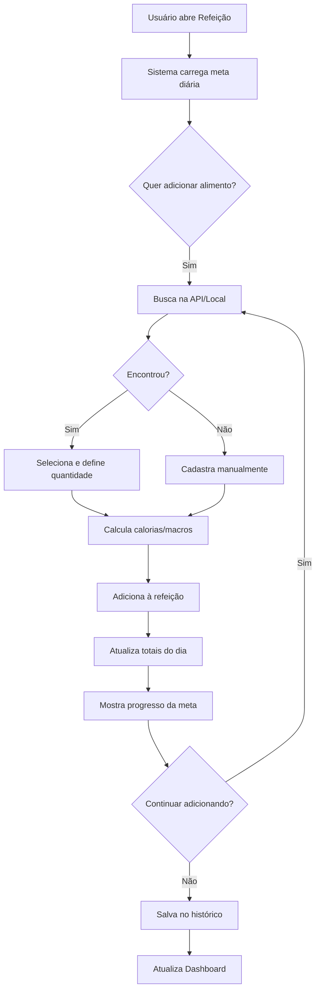
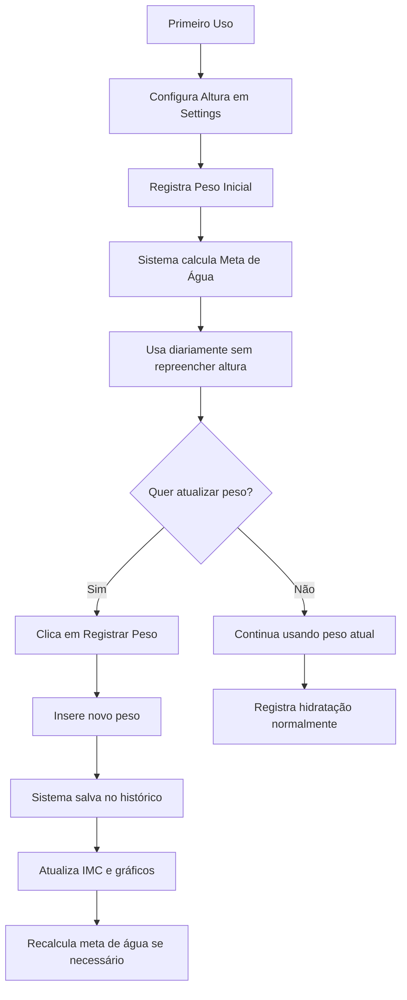
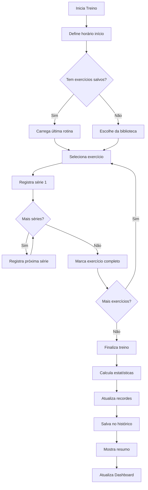

# 📋 Estratégia de Melhorias - Sistema de Saúde e Bem-Estar

> Documento de planejamento para expansão das funcionalidades de saúde (Alimentação, Hidratação e Exercícios)

**Data:** 15 de novembro de 2025  
**Versão:** 1.0

---

## 📌 Visão Geral

Este documento detalha a estratégia para implementar um sistema mais robusto e inteligente de acompanhamento de saúde, focando em três pilares principais:

1. **🍽️ Alimentação com Contador de Calorias**
2. **💧 Hidratação com Histórico de Peso**
3. **💪 Exercícios com Registro de Performance**

---

## 🎯 Objetivos

### Gerais

- Tornar o sistema mais útil e prático para o usuário
- Reduzir entrada manual repetitiva de dados
- Fornecer métricas e evolução ao longo do tempo
- Criar um sistema de acompanhamento personalizado

### Específicos

- Implementar contador de calorias inteligente
- Criar histórico de peso com gráfico de evolução
- Adicionar sistema de registro de exercícios específicos
- Mover altura para configurações gerais
- Criar dashboards de evolução para cada categoria

---

## 🍽️ 1. ALIMENTAÇÃO - Sistema de Calorias

### 1.1 Situação Atual

```javascript
// Atual: meals.js
- Configuração de refeições (nome e descrição)
- Contador simples de refeições
- Sem controle de calorias
- Sem informações nutricionais
```

### 1.2 Proposta de Melhoria

#### **Opção A: Sistema Híbrido (RECOMENDADO)**

**Justificativa:**

- Melhor experiência do usuário
- Flexibilidade para alimentos personalizados
- Dados confiáveis via API para alimentos comuns
- Funciona offline para alimentos cadastrados

**Estrutura:**

```javascript
{
  userProfile: {
    dailyCaloriesGoal: 2000, // Meta diária configurável
    height: 175, // Movido para configurações gerais
    currentWeight: 70,
    mealsConfig: [...] // Mantém configuração atual
  },

  foodDatabase: {
    // API Foods (cache local)
    api: [
      {
        id: "api_001",
        name: "Arroz Branco (100g)",
        calories: 130,
        protein: 2.7,
        carbs: 28,
        fat: 0.3,
        source: "TACO/USDA"
      }
    ],
    // User Custom Foods
    custom: [
      {
        id: "custom_001",
        name: "Minha Receita Especial",
        calories: 450,
        protein: 30,
        carbs: 40,
        fat: 15,
        createdAt: "2025-11-15"
      }
    ]
  },

  dailyMealTracking: {
    "2025-11-15": {
      breakfast: {
        foods: [
          { id: "api_001", name: "Arroz", quantity: 150, calories: 195 },
          { id: "custom_001", name: "Omelete", quantity: 1, calories: 200 }
        ],
        totalCalories: 395,
        time: "08:30"
      },
      lunch: { foods: [...], totalCalories: 650 },
      dinner: { foods: [...], totalCalories: 500 },
      snacks: { foods: [...], totalCalories: 150 },

      dailyTotal: 1695,
      goalCalories: 2000,
      remaining: 305,
      percentage: 84.75
    }
  }
}
```

#### **APIs Sugeridas:**

1. **OpenFoodFacts API** (RECOMENDADO)

   - ✅ Gratuita e open-source
   - ✅ Base brasileira (TACO)
   - ✅ Não precisa autenticação
   - ✅ Funciona offline após cache

   ```javascript
   // Exemplo de chamada
   fetch("https://br.openfoodfacts.org/api/v0/product/7891000100103.json");
   ```

2. **Tabela TACO (USP)** - Offline

   - ✅ Completamente gratuita
   - ✅ Dados brasileiros confiáveis
   - ✅ Pode ser incluída no projeto
   - ⚠️ Precisa ser baixada e integrada

3. **USDA FoodData Central**
   - ✅ Gratuita com API key
   - ⚠️ Dados americanos (pode não ter alimentos BR)

**Implementação Recomendada:**

```
1. Usar OpenFoodFacts como principal
2. Fallback para base TACO offline (JSON local)
3. Permitir cadastro manual pelo usuário
4. Cache local de alimentos pesquisados
```

### 1.3 Interface Proposta

```
📱 Tela de Refeição (Ex: Café da Manhã)
┌─────────────────────────────────────┐
│ ☀️ Café da Manhã - 08:30           │
│                                     │
│ 🎯 Meta de hoje: 2000 cal           │
│ ✅ Consumido: 395 cal (19.75%)      │
│ 📊 Restante: 1605 cal               │
│                                     │
│ ➕ Adicionar Alimento               │
│                                     │
│ ┌─────────────────────────────────┐│
│ │ 🔍 Pesquisar ou Criar           ││
│ │ [________________]  [Buscar]    ││
│ └─────────────────────────────────┘│
│                                     │
│ Alimentos Adicionados:              │
│ ┌─────────────────────────────────┐│
│ │ 🍚 Arroz Branco                 ││
│ │ 150g • 195 cal                  ││
│ │ P: 4g • C: 42g • G: 0.5g   [🗑] ││
│ └─────────────────────────────────┘│
│                                     │
│ ┌─────────────────────────────────┐│
│ │ 🍳 Omelete (Personalizado)      ││
│ │ 1 unidade • 200 cal             ││
│ │ P: 15g • C: 2g • G: 15g    [🗑] ││
│ └─────────────────────────────────┘│
│                                     │
│ [Salvar Refeição] [Ver Dashboard]  │
└─────────────────────────────────────┘

📊 Dashboard de Alimentação
┌─────────────────────────────────────┐
│ 📈 Evolução Semanal de Calorias     │
│                                     │
│  2200|        ╱╲                    │
│  2000|───────●──●───── Meta         │
│  1800|      ╱    ╲                  │
│  1600|    ●        ●                │
│      └──S──T──Q──Q──S──S──D        │
│                                     │
│ 🎯 Semana Atual:                    │
│   • Média: 1850 cal/dia             │
│   • Meta: 2000 cal/dia              │
│   • Aderência: 92.5%                │
│                                     │
│ 🥇 Macronutrientes Médios:          │
│   Proteínas: 85g (22%)              │
│   Carboidratos: 230g (50%)          │
│   Gorduras: 58g (28%)               │
└─────────────────────────────────────┘
```

### 1.4 Fluxo de Trabalho



### 1.5 Estrutura de Arquivos

```
js/categories/meals.js (expandir)
js/nutrition/
  ├── food-api.js          # Integração com APIs
  ├── food-database.js     # Database local (TACO)
  ├── calorie-tracker.js   # Lógica de tracking
  ├── macro-calculator.js  # Cálculo de macros
  └── nutrition-goals.js   # Metas e objetivos

data/
  └── taco-foods.json      # Base TACO offline

components/nutrition/
  ├── food-search.html     # Busca de alimentos
  ├── food-form.html       # Formulário customizado
  ├── meal-tracker.html    # Tela de refeição
  └── nutrition-dashboard.html

css/nutrition/
  ├── food-cards.css
  ├── nutrition-dashboard.css
  └── calorie-tracker.css
```

---

## 💧 2. HIDRATAÇÃO - Histórico de Peso

### 2.1 Situação Atual

```javascript
// Atual: hydration.js
- Usuário preenche peso/altura todo dia
- Dados armazenados em userProfile (sobrescreve)
- Altura salva repetidamente
- Sem histórico de peso
```

### 2.2 Proposta de Melhoria

#### **Mudanças:**

1. **Altura → Configurações Gerais** (única vez)
2. **Peso → Histórico com Data**
3. **Dashboard de Evolução de Peso**

**Nova Estrutura:**

```javascript
{
  userProfile: {
    height: 175, // Configurado uma vez em Settings
    dailyWaterGoal: 2450, // Calculado uma vez
    gender: "male", // Opcional: ajuda no cálculo
    birthDate: "1990-01-15", // Opcional: para metas por idade
    activityLevel: "moderate" // Opcional: ajusta necessidade de água
  },

  weightHistory: [
    {
      id: "weight_001",
      date: "2025-11-01",
      weight: 72.5,
      bmi: 23.7,
      registeredAt: "2025-11-01T08:30:00",
      note: "Após café da manhã" // Opcional
    },
    {
      id: "weight_002",
      date: "2025-11-08",
      weight: 71.8,
      bmi: 23.4,
      registeredAt: "2025-11-08T08:15:00"
    },
    {
      id: "weight_003",
      date: "2025-11-15",
      weight: 71.2,
      bmi: 23.2,
      registeredAt: "2025-11-15T08:20:00"
    }
  ],

  hydrationTracking: {
    "2025-11-15": {
      goal: 2450, // ml
      consumed: 1800,
      remaining: 650,
      percentage: 73.5,
      weight: 71.2, // Referência ao peso atual
      logs: [
        { time: "08:30", amount: 300 },
        { time: "10:00", amount: 500 },
        { time: "14:30", amount: 500 },
        { time: "18:00", amount: 500 }
      ]
    }
  }
}
```

### 2.3 Interface Proposta

```
⚙️ Configurações Gerais (Nova Seção)
┌─────────────────────────────────────┐
│ 📏 Dados Físicos                    │
│                                     │
│ Altura: [175] cm                    │
│ Sexo: (•) M  ( ) F  ( ) Outro      │
│ Data Nasc: [15/01/1990]            │
│ Nível Atividade:                    │
│   [Moderado ▼]                      │
│                                     │
│ ⚖️ Peso Atual: 71.2 kg              │
│ 📅 Última atualização: Hoje 08:20   │
│                                     │
│ [📝 Registrar Novo Peso]            │
│ [📊 Ver Histórico Completo]         │
└─────────────────────────────────────┘

⚖️ Modal de Registro de Peso
┌─────────────────────────────────────┐
│ 📝 Registrar Peso                   │
│                                     │
│ Data: [15/11/2025]                  │
│ Peso: [____] kg                     │
│                                     │
│ 📝 Observação (opcional):           │
│ [________________________]          │
│                                     │
│ Último peso: 71.8 kg (há 7 dias)    │
│                                     │
│ [Cancelar]  [Salvar Peso]          │
└─────────────────────────────────────┘

💧 Tela de Hidratação (Simplificada)
┌─────────────────────────────────────┐
│ 💧 Hidratação - 15/11/2025          │
│                                     │
│ 🎯 Meta: 2450 ml (2.45 L)           │
│ ✅ Consumido: 1800 ml (73.5%)       │
│                                     │
│ ┌─────────────────────────────────┐│
│ │ 💧💧💧💧💧💧💧░░░               ││
│ └─────────────────────────────────┘│
│                                     │
│ 📊 Registrar Consumo:               │
│ [250ml] [500ml] [750ml] [Custom]    │
│                                     │
│ ⚖️ Peso atual: 71.2 kg (IMC: 23.2)  │
│ [📝 Atualizar Peso]                 │
└─────────────────────────────────────┘

📊 Dashboard de Evolução de Peso
┌─────────────────────────────────────┐
│ 📈 Evolução de Peso (3 meses)       │
│                                     │
│  73|●                               │
│  72|  ●                             │
│  71|    ●──●                        │
│  70|        ╲ ●                     │
│     └──Nov──Dez──Jan──Fev          │
│                                     │
│ 📊 Estatísticas:                    │
│   Peso Inicial: 72.5 kg             │
│   Peso Atual: 71.2 kg               │
│   Variação: -1.3 kg (-1.8%)         │
│   IMC: 23.2 (Peso Normal)           │
│   Meta: 70 kg                       │
│   Faltam: 1.2 kg                    │
│                                     │
│ 🎯 Tendência: Perda gradual saudável│
│    (0.4 kg/mês em média)            │
└─────────────────────────────────────┘
```

### 2.4 Fluxo de Trabalho



### 2.5 Estrutura de Arquivos

```
js/categories/hydration.js (simplificar)
js/health/
  ├── weight-tracker.js        # Gerencia histórico de peso
  ├── bmi-calculator.js        # Cálculo de IMC
  ├── weight-goals.js          # Metas de peso
  └── water-calculator.js      # Cálculo de necessidade de água

js/settings/
  └── user-profile.js          # Configurações gerais (altura, etc)

components/health/
  ├── weight-registration.html # Modal de registro
  ├── weight-dashboard.html    # Dashboard de evolução
  └── settings-profile.html    # Configurações gerais

css/health/
  ├── weight-tracker.css
  └── weight-dashboard.css
```

---

## 💪 3. EXERCÍCIOS - Sistema de Performance

### 3.1 Situação Atual

```javascript
// Atual: exercise.js
- Apenas horário de exercício
- Tipo genérico de exercício
- Sem registro de atividades específicas
- Sem métricas de evolução
```

### 3.2 Proposta de Melhoria

#### **Novo Sistema:**

1. **Biblioteca de Exercícios**
2. **Registro de Séries e Repetições**
3. **Histórico e Evolução**
4. **Dashboard de Performance**

**Estrutura:**

```javascript
{
  exerciseLibrary: {
    strength: [
      {
        id: "ex_001",
        name: "Flexão",
        category: "strength",
        muscleGroup: ["peito", "tríceps", "ombros"],
        difficulty: "beginner",
        description: "Flexão de braço tradicional",
        icon: "💪"
      },
      {
        id: "ex_002",
        name: "Barra Fixa",
        category: "strength",
        muscleGroup: ["costas", "bíceps"],
        difficulty: "intermediate",
        description: "Pull-up na barra",
        icon: "🏋️"
      },
      {
        id: "ex_003",
        name: "Agachamento",
        category: "strength",
        muscleGroup: ["pernas", "glúteos"],
        difficulty: "beginner",
        description: "Agachamento livre",
        icon: "🦵"
      }
    ],
    cardio: [
      {
        id: "ex_101",
        name: "Corrida",
        category: "cardio",
        unit: "km",
        icon: "🏃"
      }
    ]
  },

  workoutHistory: {
    "2025-11-15": {
      workoutId: "workout_001",
      startTime: "07:00",
      endTime: "08:00",
      duration: 60,
      type: "strength",

      exercises: [
        {
          exerciseId: "ex_001",
          name: "Flexão",
          sets: [
            { set: 1, reps: 15, weight: 0, completed: true },
            { set: 2, reps: 12, weight: 0, completed: true },
            { set: 3, reps: 10, weight: 0, completed: true }
          ],
          totalReps: 37,
          notes: "Senti dificuldade na última série"
        },
        {
          exerciseId: "ex_002",
          name: "Barra Fixa",
          sets: [
            { set: 1, reps: 8, weight: 0, completed: true },
            { set: 2, reps: 6, weight: 0, completed: true },
            { set: 3, reps: 5, weight: 0, completed: false }
          ],
          totalReps: 14
        },
        {
          exerciseId: "ex_003",
          name: "Agachamento",
          sets: [
            { set: 1, reps: 20, weight: 0, completed: true },
            { set: 2, reps: 18, weight: 0, completed: true },
            { set: 3, reps: 15, weight: 0, completed: true }
          ],
          totalReps: 53
        }
      ],

      totalExercises: 3,
      completedExercises: 2,
      completionRate: 66.67,
      caloriesBurned: 320 // Estimativa
    }
  },

  personalRecords: {
    "ex_001": { // Flexão
      maxReps: 15,
      date: "2025-11-15",
      totalSessions: 24,
      totalReps: 856
    },
    "ex_002": { // Barra
      maxReps: 8,
      date: "2025-11-15",
      totalSessions: 18,
      totalReps: 312
    }
  },

  exerciseGoals: {
    "ex_001": {
      currentMax: 15,
      goalMax: 30,
      targetDate: "2025-12-31"
    }
  }
}
```

### 3.3 Interface Proposta

```
💪 Tela de Exercício
┌─────────────────────────────────────┐
│ 💪 Treino - 15/11/2025              │
│                                     │
│ ⏰ Duração: 00:45:30                │
│ 🔥 Calorias: ~280 kcal              │
│                                     │
│ 📋 Exercícios de Hoje:              │
│                                     │
│ ┌─────────────────────────────────┐│
│ │ 💪 Flexão                       ││
│ │ ✅ 3 séries • 37 reps total     ││
│ │ 🏆 Recorde: 15 reps             ││
│ │ [Ver Detalhes]                  ││
│ └─────────────────────────────────┘│
│                                     │
│ ┌─────────────────────────────────┐│
│ │ 🏋️ Barra Fixa                   ││
│ │ ⚠️ 2/3 séries • 14 reps         ││
│ │ 🎯 Próximo: 8 reps              ││
│ │ [Continuar]                     ││
│ └─────────────────────────────────┘│
│                                     │
│ ➕ [Adicionar Exercício]            │
│                                     │
│ [Finalizar Treino] [Ver Evolução]  │
└─────────────────────────────────────┘

📝 Registro de Exercício
┌─────────────────────────────────────┐
│ 💪 Flexão                           │
│                                     │
│ Série 1: [15] reps  ✅              │
│ Série 2: [12] reps  ✅              │
│ Série 3: [10] reps  ✅              │
│                                     │
│ ➕ [Adicionar Série]                │
│                                     │
│ 📝 Observações:                     │
│ [________________________]          │
│                                     │
│ 🏆 Seu recorde: 15 reps             │
│ 📊 Média últimas 7 sessões: 13 reps │
│                                     │
│ [Voltar]  [Salvar]                 │
└─────────────────────────────────────┘

📊 Dashboard de Evolução
┌─────────────────────────────────────┐
│ 📈 Evolução - Flexão                │
│                                     │
│ Máximo por Sessão (últimas 8)       │
│  16|              ●                 │
│  14|        ●   ●                   │
│  12|    ●                           │
│  10|  ●                             │
│     └──────────────────────         │
│                                     │
│ 🏆 Recordes Pessoais:               │
│   Máximo: 15 reps (15/11/2025)      │
│   Total: 856 reps (24 treinos)      │
│   Média: 35.7 reps/treino           │
│                                     │
│ 📊 Estatísticas do Mês:             │
│   Treinos: 12                       │
│   Total reps: 420                   │
│   Evolução: +18% vs mês anterior    │
│                                     │
│ 🎯 Meta: 30 reps até 31/12          │
│   Faltam: 15 reps (50% alcançado)   │
└─────────────────────────────────────┘

📚 Biblioteca de Exercícios
┌─────────────────────────────────────┐
│ 💪 Força  🏃 Cardio  🧘 Flexibilidade│
│                                     │
│ 🔍 Pesquisar: [____________]        │
│                                     │
│ ┌─────────────────────────────────┐│
│ │ 💪 Flexão                       ││
│ │ Peito, Tríceps, Ombros          ││
│ │ ⭐ Iniciante                    ││
│ │ Usado 24x                       ││
│ └─────────────────────────────────┘│
│                                     │
│ ┌─────────────────────────────────┐│
│ │ 🏋️ Barra Fixa                   ││
│ │ Costas, Bíceps                  ││
│ │ ⭐⭐ Intermediário              ││
│ │ Usado 18x                       ││
│ └─────────────────────────────────┘│
│                                     │
│ ➕ [Criar Exercício Personalizado]  │
└─────────────────────────────────────┘
```

### 3.4 Fluxo de Trabalho



### 3.5 Estrutura de Arquivos

```
js/categories/exercise.js (expandir)
js/exercise/
  ├── exercise-library.js      # Biblioteca de exercícios
  ├── workout-tracker.js       # Tracking de treino
  ├── sets-reps-manager.js     # Gerencia séries/reps
  ├── personal-records.js      # Recordes pessoais
  ├── workout-stats.js         # Estatísticas
  └── calorie-estimator.js     # Estimativa de calorias

data/
  └── exercises-database.json  # Base de exercícios

components/exercise/
  ├── exercise-library.html    # Biblioteca
  ├── workout-tracker.html     # Tela de treino
  ├── exercise-form.html       # Registro de séries
  ├── workout-summary.html     # Resumo pós-treino
  └── exercise-dashboard.html  # Dashboard evolução

css/exercise/
  ├── exercise-cards.css
  ├── workout-tracker.css
  └── exercise-dashboard.css
```

---

## 🎨 4. DASHBOARD UNIFICADO

### 4.1 Expandir Dashboard Existente

```javascript
// Adicionar ao dashboard atual
{
  nutrition: {
    weeklyCalories: [...],
    averageCalories: 1850,
    goalCalories: 2000,
    adherence: 92.5,
    macros: {
      protein: 85,
      carbs: 230,
      fat: 58
    }
  },

  weight: {
    current: 71.2,
    initial: 72.5,
    change: -1.3,
    trend: "decreasing",
    weeklyChange: -0.3
  },

  exercise: {
    totalWorkouts: 12,
    totalReps: 856,
    topExercise: "Flexão",
    caloriesBurned: 3840,
    newRecords: 2
  }
}
```

### 4.2 Interface do Dashboard

```
📊 Dashboard de Saúde (Expandido)
┌───────────────────────────────────────────────┐
│ 🍽️ Alimentação                                │
│ ┌──────────────────────────────────────────┐ │
│ │ 📈 1850 cal/dia (média semanal)          │ │
│ │ 🎯 Meta: 2000 cal • 92.5% aderência      │ │
│ │                                           │ │
│ │ Macros: P:22% | C:50% | G:28%            │ │
│ └──────────────────────────────────────────┘ │
│                                               │
│ ⚖️ Peso e IMC                                 │
│ ┌──────────────────────────────────────────┐ │
│ │ 📉 71.2 kg (-1.3 kg no mês)              │ │
│ │ 💪 IMC: 23.2 (Peso Normal)               │ │
│ │ 🎯 Meta: 70 kg (faltam 1.2 kg)           │ │
│ └──────────────────────────────────────────┘ │
│                                               │
│ 💪 Exercícios                                 │
│ ┌──────────────────────────────────────────┐ │
│ │ 🏋️ 12 treinos no mês                     │ │
│ │ 🔥 3840 kcal queimadas                   │ │
│ │ 🏆 2 novos recordes pessoais!            │ │
│ │ ⭐ Mais praticado: Flexão (24x)          │ │
│ └──────────────────────────────────────────┘ │
│                                               │
│ 💧 Hidratação                                 │
│ ┌──────────────────────────────────────────┐ │
│ │ 🥤 2.1 L/dia (média semanal)             │ │
│ │ 🎯 Meta: 2.45 L • 85% aderência          │ │
│ └──────────────────────────────────────────┘ │
└───────────────────────────────────────────────┘
```

---

## 🗂️ 5. ESTRUTURA GERAL DO PROJETO

### 5.1 Organização de Pastas (Atualizada)

```
Lifestyle/
├── js/
│   ├── categories/
│   │   ├── meals.js (expandir)
│   │   ├── hydration.js (simplificar)
│   │   └── exercise.js (expandir)
│   │
│   ├── nutrition/          # NOVO
│   │   ├── food-api.js
│   │   ├── food-database.js
│   │   ├── calorie-tracker.js
│   │   ├── macro-calculator.js
│   │   └── nutrition-goals.js
│   │
│   ├── health/             # NOVO
│   │   ├── weight-tracker.js
│   │   ├── bmi-calculator.js
│   │   ├── weight-goals.js
│   │   └── water-calculator.js
│   │
│   ├── exercise/           # NOVO
│   │   ├── exercise-library.js
│   │   ├── workout-tracker.js
│   │   ├── sets-reps-manager.js
│   │   ├── personal-records.js
│   │   ├── workout-stats.js
│   │   └── calorie-estimator.js
│   │
│   ├── settings/           # NOVO
│   │   └── user-profile.js
│   │
│   └── ui/
│       └── dashboard/
│           └── cards/
│               ├── nutrition-card.js   # NOVO
│               ├── weight-card.js      # NOVO
│               └── exercise-card.js    # NOVO
│
├── components/
│   ├── nutrition/          # NOVO
│   │   ├── food-search.html
│   │   ├── food-form.html
│   │   ├── meal-tracker.html
│   │   └── nutrition-dashboard.html
│   │
│   ├── health/             # NOVO
│   │   ├── weight-registration.html
│   │   ├── weight-dashboard.html
│   │   └── settings-profile.html
│   │
│   └── exercise/           # NOVO
│       ├── exercise-library.html
│       ├── workout-tracker.html
│       ├── exercise-form.html
│       ├── workout-summary.html
│       └── exercise-dashboard.html
│
├── css/
│   ├── nutrition/          # NOVO
│   │   ├── food-cards.css
│   │   ├── nutrition-dashboard.css
│   │   └── calorie-tracker.css
│   │
│   ├── health/             # NOVO
│   │   ├── weight-tracker.css
│   │   └── weight-dashboard.css
│   │
│   ├── exercise/           # NOVO
│   │   ├── exercise-cards.css
│   │   ├── workout-tracker.css
│   │   └── exercise-dashboard.css
│   │
│   └── dashboard/
│       └── cards/
│           ├── nutrition-card.css  # NOVO
│           ├── weight-card.css     # NOVO
│           └── exercise-card.css   # NOVO
│
├── data/                   # NOVO
│   ├── taco-foods.json
│   └── exercises-database.json
│
└── tests/
    ├── nutrition.test.js   # NOVO
    ├── weight-tracker.test.js  # NOVO
    └── exercise-tracker.test.js  # NOVO
```

---

## 📋 6. PLANO DE IMPLEMENTAÇÃO

### Fase 1: Configurações e Peso (1-2 semanas)

- [ ] Criar seção de Configurações Gerais
- [ ] Mover altura para configurações
- [ ] Implementar sistema de histórico de peso
- [ ] Criar modal de registro de peso
- [ ] Desenvolver dashboard de evolução de peso
- [ ] Simplificar tela de hidratação
- [ ] Testes unitários

### Fase 2: Alimentação - Base (2-3 semanas)

- [ ] Integrar OpenFoodFacts API
- [ ] Criar cache local de alimentos
- [ ] Baixar e integrar tabela TACO
- [ ] Desenvolver sistema de busca de alimentos
- [ ] Implementar formulário de alimento customizado
- [ ] Criar estrutura de dados de tracking
- [ ] Testes de API e cache

### Fase 3: Alimentação - Interface (2 semanas)

- [ ] Desenvolver tela de refeição
- [ ] Implementar adicionar/remover alimentos
- [ ] Criar indicadores de progresso
- [ ] Desenvolver cálculo de macronutrientes
- [ ] Implementar metas diárias
- [ ] Design e CSS
- [ ] Testes de interface

### Fase 4: Alimentação - Dashboard (1 semana)

- [ ] Criar gráfico de evolução de calorias
- [ ] Implementar estatísticas semanais/mensais
- [ ] Desenvolver análise de macronutrientes
- [ ] Criar indicadores de aderência
- [ ] Integrar ao dashboard principal
- [ ] Testes de dashboard

### Fase 5: Exercícios - Base (2 semanas)

- [ ] Criar biblioteca de exercícios
- [ ] Desenvolver sistema de workout tracking
- [ ] Implementar registro de séries/reps
- [ ] Criar estrutura de recordes pessoais
- [ ] Desenvolver cálculo de estatísticas
- [ ] Testes unitários

### Fase 6: Exercícios - Interface (2 semanas)

- [ ] Desenvolver tela de treino
- [ ] Criar biblioteca visual de exercícios
- [ ] Implementar formulário de registro
- [ ] Desenvolver resumo pós-treino
- [ ] Design e CSS
- [ ] Testes de interface

### Fase 7: Exercícios - Evolução (1-2 semanas)

- [ ] Criar dashboard de evolução
- [ ] Implementar gráficos de progresso
- [ ] Desenvolver sistema de metas
- [ ] Criar análise de tendências
- [ ] Integrar ao dashboard principal
- [ ] Testes completos

### Fase 8: Integração e Polimento (1 semana)

- [ ] Integrar todos os dashboards
- [ ] Criar visualizações consolidadas
- [ ] Otimizar performance
- [ ] Revisar UX/UI
- [ ] Documentação
- [ ] Testes E2E completos

**Tempo Total Estimado: 12-15 semanas**

---

## 🎯 7. MÉTRICAS DE SUCESSO

### Usabilidade

- [ ] Usuário consegue registrar refeição em < 2 minutos
- [ ] Atualizar peso em < 30 segundos
- [ ] Registrar treino em < 5 minutos
- [ ] Altura configurada apenas 1 vez

### Funcionalidade

- [ ] 90%+ de alimentos encontrados na API/TACO
- [ ] Histórico de peso preservado por 12+ meses
- [ ] Recordes pessoais calculados corretamente
- [ ] Gráficos renderizam em < 2 segundos

### Precisão

- [ ] Cálculos de calorias precisos ±5%
- [ ] IMC calculado corretamente
- [ ] Meta de água ajustada ao peso
- [ ] Estatísticas de exercícios sem erros

---

## 🚀 8. TECNOLOGIAS E BIBLIOTECAS

### APIs Externas

- **OpenFoodFacts API** - Base de alimentos
- Fallback offline com TACO

### Bibliotecas JavaScript (Opcionais)

- **Chart.js** - Gráficos de evolução (já usado?)
- **Day.js** - Manipulação de datas
- **LocalForage** - Storage avançado

### Ferramentas

- **Jest** - Testes (já configurado)
- **Prettier/ESLint** - Code quality

---

## 📝 9. CONSIDERAÇÕES FINAIS

### Prioridades

1. **Implementar primeiro o sistema de peso** - Base para outras features
2. **Depois alimentação** - Feature mais complexa
3. **Por último exercícios** - Depende menos das outras

### Opções de API

**RECOMENDAÇÃO: OpenFoodFacts**

- Gratuita, sem limites
- Base brasileira (TACO integrada)
- Sem necessidade de chave de API
- Funciona offline após cache

### Backup de Dados

- Implementar export/import de históricos
- Sincronização com localStorage
- Considerar backup em nuvem no futuro

### Performance

- Lazy loading de dashboards
- Cache agressivo de alimentos
- Índices em históricos grandes
- Otimização de gráficos

---

## ❓ 10. DECISÕES PENDENTES

1. **Alimentação:**

   - ✅ Usar API híbrida (OpenFoodFacts + Custom)
   - [ ] Permitir scan de códigos de barras? (futuro)
   - [ ] Importar receitas completas?

2. **Peso:**

   - ✅ Histórico infinito ou limite de 12 meses?
   - [ ] Permitir múltiplas medições por dia?
   - [ ] Adicionar % de gordura corporal?

3. **Exercícios:**

   - [ ] Incluir exercícios de cardio (km, tempo)?
   - [ ] Adicionar planos de treino pré-definidos?
   - [ ] Incluir vídeos/GIFs de instruções?

4. **Geral:**
   - [ ] Notificações push para lembrar de registrar?
   - [ ] Gamificação (badges, conquistas)?
   - [ ] Compartilhamento social de conquistas?

---

## 📞 Próximos Passos

1. **Revisar este documento** e ajustar prioridades
2. **Decidir sobre APIs** e bibliotecas
3. **Criar mockups detalhados** (Figma?)
4. **Começar pela Fase 1** (Configurações e Peso)
5. **Implementar incrementalmente** com testes

---

**Documento mantido por:** José Cícero  
**Última atualização:** 15/11/2025  
**Versão:** 1.0
