# 📋 Estratégia de Melhorias - Sistema de Saúde e Bem-Estar

> Documento de planejamento para expansão das funcionalidades de saúde (Alimentação, Hidratação e Exercícios)

**Data:** 15 de novembro de 2025  
**Versão:** 1.0

---

## 📌 Visão Geral

Este documento detalha a estratégia para implementar um sistema mais robusto e inteligente de acompanhamento de saúde, focando em três pilares principais:

1. **🍽️ Alimentação com Contador de Calorias**
2. **💧 Hidratação com Histórico de Peso**
3. **💪 Exercícios com Registro de Performance**

---

## 🎯 Objetivos

### Gerais

- Tornar o sistema mais útil e prático para o usuário
- Reduzir entrada manual repetitiva de dados
- Fornecer métricas e evolução ao longo do tempo
- Criar um sistema de acompanhamento personalizado

### Específicos

- Implementar contador de calorias inteligente
- Criar histórico de peso com gráfico de evolução
- Adicionar sistema de registro de exercícios específicos
- Mover altura para configurações gerais
- Criar dashboards de evolução para cada categoria

---

## 🍽️ 1. ALIMENTAÇÃO - Sistema de Calorias

### 1.1 Situação Atual

```javascript
// Atual: meals.js
- Configuração de refeições (nome e descrição)
- Contador simples de refeições
- Sem controle de calorias
- Sem informações nutricionais
```

### 1.2 Proposta de Melhoria

#### **Opção A: Sistema Híbrido com Receitas (RECOMENDADO)**

**Justificativa:**

- Melhor experiência do usuário
- Flexibilidade para alimentos personalizados e receitas compostas
- Dados confiáveis via API para alimentos comuns
- Funciona offline para alimentos cadastrados
- Permite criar receitas complexas (ex: vitaminas, smoothies, pratos completos)

**Estrutura:**

```javascript
{
  userProfile: {
    dailyCaloriesGoal: 2000, // Meta diária configurável
    height: 175, // Movido para configurações gerais
    currentWeight: 70,
    mealsConfig: [...] // Mantém configuração atual
  },

  foodDatabase: {
    // API Foods (cache local)
    api: [
      {
        id: "api_001",
        name: "Arroz Branco",
        calories: 130, // por 100g
        protein: 2.7,
        carbs: 28,
        fat: 0.3,
        unit: "g",
        defaultServing: 100,
        source: "TACO/USDA"
      },
      {
        id: "api_002",
        name: "Banana com casca",
        calories: 98, // por 100g
        protein: 1.3,
        carbs: 23,
        fat: 0.2,
        unit: "g",
        defaultServing: 118, // 1 banana média
        alternativeUnit: "unidade",
        source: "TACO"
      },
      {
        id: "api_003",
        name: "Aveia em flocos",
        calories: 394,
        protein: 13.9,
        carbs: 66.6,
        fat: 8.5,
        unit: "g",
        defaultServing: 15, // 1 colher de sopa
        source: "TACO"
      },
      {
        id: "api_004",
        name: "Iogurte natural integral",
        calories: 51,
        protein: 3.5,
        carbs: 4.0,
        fat: 2.5,
        unit: "ml",
        defaultServing: 200,
        source: "TACO"
      },
      {
        id: "api_005",
        name: "Açúcar refinado",
        calories: 387,
        protein: 0,
        carbs: 99.8,
        fat: 0,
        unit: "g",
        defaultServing: 10, // 1 colher de sopa
        source: "TACO"
      }
    ],
    
    // User Custom Foods (alimentos simples)
    custom: [
      {
        id: "custom_001",
        name: "Meu Tempero Caseiro",
        calories: 50,
        protein: 1,
        carbs: 8,
        fat: 2,
        unit: "g",
        defaultServing: 10,
        createdAt: "2025-11-15"
      }
    ],
    
    // User Recipes (receitas compostas) - NOVO!
    recipes: [
      {
        id: "recipe_001",
        name: "Vitamina de Banana com Aveia",
        category: "breakfast",
        icon: "🥤",
        servings: 1,
        createdAt: "2025-11-15",
        updatedAt: "2025-11-15",
        
        ingredients: [
          {
            foodId: "api_002",
            foodName: "Banana com casca",
            quantity: 236, // 2 bananas médias
            unit: "g",
            displayQuantity: "2 unidades",
            calories: 231,
            protein: 3.1,
            carbs: 54.3,
            fat: 0.5
          },
          {
            foodId: "api_003",
            foodName: "Aveia em flocos",
            quantity: 75, // 5 colheres de sopa
            unit: "g",
            displayQuantity: "5 colheres de sopa",
            calories: 296,
            protein: 10.4,
            carbs: 49.9,
            fat: 6.4
          },
          {
            foodId: "api_004",
            foodName: "Iogurte natural integral",
            quantity: 200,
            unit: "ml",
            displayQuantity: "200ml",
            calories: 102,
            protein: 7.0,
            carbs: 8.0,
            fat: 5.0
          },
          {
            foodId: null, // Água não tem calorias, opcional no banco
            foodName: "Água",
            quantity: 300,
            unit: "ml",
            displayQuantity: "300ml",
            calories: 0,
            protein: 0,
            carbs: 0,
            fat: 0
          },
          {
            foodId: "api_005",
            foodName: "Açúcar refinado",
            quantity: 20, // 2 colheres de sopa
            unit: "g",
            displayQuantity: "2 colheres de sopa",
            calories: 77,
            protein: 0,
            carbs: 20.0,
            fat: 0
          }
        ],
        
        // Totais calculados automaticamente
        totals: {
          calories: 706,
          protein: 20.5,
          carbs: 132.2,
          fat: 11.9,
          weight: 831 // peso total em gramas
        },
        
        instructions: "Bater tudo no liquidificador até ficar homogêneo",
        notes: "Pode adicionar gelo a gosto",
        tags: ["vitamina", "café da manhã", "banana", "aveia"],
        isFavorite: true,
        timesUsed: 12
      }
    ]
  },

  dailyMealTracking: {
    "2025-11-15": {
      breakfast: {
        items: [
          // Pode adicionar receita inteira
          {
            type: "recipe",
            id: "recipe_001",
            name: "Vitamina de Banana com Aveia",
            servings: 1,
            calories: 706,
            protein: 20.5,
            carbs: 132.2,
            fat: 11.9
          },
          // Ou alimentos individuais
          {
            type: "food",
            id: "api_001",
            name: "Pão integral",
            quantity: 50,
            unit: "g",
            calories: 130,
            protein: 4.5,
            carbs: 20,
            fat: 2.5
          }
        ],
        totalCalories: 836,
        totalProtein: 25.0,
        totalCarbs: 152.2,
        totalFat: 14.4,
        time: "08:30"
      },
      lunch: {
        items: [
          {
            type: "food",
            id: "api_006",
            name: "Arroz branco cozido",
            quantity: 150,
            unit: "g",
            calories: 195
          },
          {
            type: "recipe",
            id: "recipe_002",
            name: "Frango grelhado temperado",
            servings: 1,
            calories: 280
          }
        ],
        totalCalories: 650
      },
      dinner: { items: [...], totalCalories: 500 },
      snacks: { items: [...], totalCalories: 150 },

      // Totais do dia
      dailyTotal: 2136,
      goalCalories: 2000,
      remaining: -136, // excedeu
      percentage: 106.8,
      
      // Macros do dia
      dailyProtein: 89,
      dailyCarbs: 245,
      dailyFat: 72
    }
  }
}
```

#### **APIs Sugeridas:**

1. **OpenFoodFacts API** (RECOMENDADO)

   - ✅ Gratuita e open-source
   - ✅ Base brasileira (TACO)
   - ✅ Não precisa autenticação
   - ✅ Funciona offline após cache

   ```javascript
   // Exemplo de chamada
   fetch("https://br.openfoodfacts.org/api/v0/product/7891000100103.json");
   ```

2. **Tabela TACO (USP)** - Offline

   - ✅ Completamente gratuita
   - ✅ Dados brasileiros confiáveis
   - ✅ Pode ser incluída no projeto
   - ⚠️ Precisa ser baixada e integrada

3. **USDA FoodData Central**
   - ✅ Gratuita com API key
   - ⚠️ Dados americanos (pode não ter alimentos BR)

**Implementação Recomendada:**

```
1. Usar OpenFoodFacts como principal
2. Fallback para base TACO offline (JSON local)
3. Permitir cadastro manual pelo usuário
4. Cache local de alimentos pesquisados
```

### 1.3 Interface Proposta

```
📱 Tela de Refeição (Ex: Café da Manhã)
┌─────────────────────────────────────┐
│ ☀️ Café da Manhã - 08:30           │
│                                     │
│ 🎯 Meta de hoje: 2000 cal           │
│ ✅ Consumido: 836 cal (41.8%)       │
│ 📊 Restante: 1164 cal               │
│                                     │
│ ➕ Adicionar  [🥘 Receitas]  [🍎 Alimentos]│
│                                     │
│ ┌─────────────────────────────────┐│
│ │ 🔍 Buscar receitas ou alimentos ││
│ │ [________________]  [Buscar]    ││
│ │ 💡 Receitas Favoritas           ││
│ └─────────────────────────────────┘│
│                                     │
│ Itens Adicionados:                  │
│ ┌─────────────────────────────────┐│
│ │ 🥤 Vitamina de Banana com Aveia ││
│ │ (Receita) • 706 cal             ││
│ │ P: 20.5g • C: 132g • G: 11.9g   ││
│ │ [📝 Ver] [📋 Copiar] [🗑 Remover]││
│ └─────────────────────────────────┘│
│                                     │
│ ┌─────────────────────────────────┐│
│ │ 🍞 Pão integral                 ││
│ │ 50g • 130 cal                   ││
│ │ P: 4.5g • C: 20g • G: 2.5g [🗑] ││
│ └─────────────────────────────────┘│
│                                     │
│ [Salvar Refeição] [Ver Dashboard]  │
└─────────────────────────────────────┘

🥘 Criar/Editar Receita
┌─────────────────────────────────────┐
│ 🥤 Nova Receita                     │
│                                     │
│ Nome: [Vitamina de Banana]          │
│ Categoria: [Café da Manhã ▼]       │
│ Ícone: [🥤 ▼]                       │
│ Porções: [1]                        │
│                                     │
│ 📋 Ingredientes:                    │
│                                     │
│ ┌─────────────────────────────────┐│
│ │ 🍌 Banana com casca             ││
│ │ Qtd: [2] [unidades ▼]           ││
│ │ (≈ 236g • 231 cal)         [🗑] ││
│ └─────────────────────────────────┘│
│                                     │
│ ┌─────────────────────────────────┐│
│ │ 🌾 Aveia em flocos              ││
│ │ Qtd: [5] [colheres sopa ▼]      ││
│ │ (≈ 75g • 296 cal)          [🗑] ││
│ └─────────────────────────────────┘│
│                                     │
│ ┌─────────────────────────────────┐│
│ │ 🥛 Iogurte natural integral     ││
│ │ Qtd: [200] [ml ▼]               ││
│ │ (200ml • 102 cal)          [🗑] ││
│ └─────────────────────────────────┘│
│                                     │
│ ┌─────────────────────────────────┐│
│ │ 💧 Água                         ││
│ │ Qtd: [300] [ml ▼]               ││
│ │ (300ml • 0 cal)            [🗑] ││
│ └─────────────────────────────────┘│
│                                     │
│ ┌─────────────────────────────────┐│
│ │ 🍬 Açúcar refinado              ││
│ │ Qtd: [2] [colheres sopa ▼]      ││
│ │ (≈ 20g • 77 cal)           [🗑] ││
│ └─────────────────────────────────┘│
│                                     │
│ ➕ [Adicionar Ingrediente]          │
│                                     │
│ ┌─────────────────────────────────┐│
│ │ 📊 Total por Porção:            ││
│ │ 🔥 706 calorias                 ││
│ │ 💪 Proteínas: 20.5g (12%)       ││
│ │ 🌾 Carboidratos: 132g (75%)     ││
│ │ 🥑 Gorduras: 11.9g (15%)        ││
│ └─────────────────────────────────┘│
│                                     │
│ 📝 Modo de Preparo:                 │
│ [Bater tudo no liquidificador...]   │
│                                     │
│ 🏷️ Tags: [vitamina] [café da manhã]│
│ ⭐ [Marcar como Favorita]           │
│                                     │
│ [Cancelar]  [Salvar Receita]       │
└─────────────────────────────────────┘

📚 Minhas Receitas
┌─────────────────────────────────────┐
│ 🥘 Minhas Receitas                  │
│                                     │
│ 🔍 Buscar: [________] 🔽 [Todas]    │
│                                     │
│ ⭐ Favoritas (3)                    │
│ ┌─────────────────────────────────┐│
│ │ 🥤 Vitamina de Banana com Aveia ││
│ │ 706 cal • Usado 12x             ││
│ │ [➕ Adicionar] [📝 Editar]       ││
│ └─────────────────────────────────┘│
│                                     │
│ ┌─────────────────────────────────┐│
│ │ 🥗 Salada Completa de Almoço    ││
│ │ 320 cal • Usado 8x              ││
│ │ [➕ Adicionar] [📝 Editar]       ││
│ └─────────────────────────────────┘│
│                                     │
│ 📂 Café da Manhã (5)                │
│ 📂 Almoço (12)                      │
│ 📂 Jantar (8)                       │
│ 📂 Lanches (6)                      │
│                                     │
│ [➕ Criar Nova Receita]             │
└─────────────────────────────────────┘

📊 Dashboard de Alimentação
┌─────────────────────────────────────┐
│ 📈 Evolução Semanal de Calorias     │
│                                     │
│  2200|        ╱╲                    │
│  2000|───────●──●───── Meta         │
│  1800|      ╱    ╲                  │
│  1600|    ●        ●                │
│      └──S──T──Q──Q──S──S──D        │
│                                     │
│ 🎯 Semana Atual:                    │
│   • Média: 1850 cal/dia             │
│   • Meta: 2000 cal/dia              │
│   • Aderência: 92.5%                │
│                                     │
│ 🥇 Macronutrientes Médios:          │
│   Proteínas: 85g (22%)              │
│   Carboidratos: 230g (50%)          │
│   Gorduras: 58g (28%)               │
└─────────────────────────────────────┘
```

### 1.4 Fluxo de Trabalho

#### Fluxo 1: Criar e Usar Receita

```mermaid
graph TD
    A[Usuário quer adicionar vitamina] --> B{Receita já existe?}
    B -->|Não| C[Clica em Criar Nova Receita]
    C --> D[Preenche nome e categoria]
    D --> E[Adiciona ingredientes um por um]
    E --> F[Busca ingrediente na API/Local]
    F --> G{Encontrou?}
    G -->|Sim| H[Seleciona e define quantidade]
    G -->|Não| I[Cadastra alimento manualmente]
    H --> J[Sistema calcula totais automaticamente]
    I --> J
    J --> K{Mais ingredientes?}
    K -->|Sim| E
    K -->|Não| L[Adiciona instruções opcionais]
    L --> M[Salva receita]
    M --> N[Receita disponível para uso]
    
    B -->|Sim| O[Busca receita salva]
    O --> P[Seleciona receita]
    P --> Q[Define número de porções]
    Q --> R[Adiciona à refeição]
    R --> S[Atualiza totais do dia]
    S --> T[Mostra progresso da meta]
```



#### Fluxo 2: Adicionar Alimentos Individuais

```mermaid
graph TD
    A[Usuário abre Refeição] --> B[Sistema carrega meta diária]
    B --> C[Clica em Adicionar Alimento]
    C --> D[Busca na API/Local]
    D --> E{Encontrou?}
    E -->|Sim| F[Seleciona alimento]
    F --> G[Define quantidade e unidade]
    G --> H[Sistema calcula calorias/macros]
    E -->|Não| I[Cadastra manualmente]
    I --> H
    H --> J[Adiciona à refeição]
    J --> K[Atualiza totais do dia]
    K --> L[Mostra progresso da meta]
    L --> M{Continuar adicionando?}
    M -->|Sim| C
    M -->|Não| N[Salva no histórico]
    N --> O[Atualiza Dashboard]
```



#### Fluxo 3: Editar Receita Existente

```mermaid
graph TD
    A[Usuário vê receita em Minhas Receitas] --> B[Clica em Editar]
    B --> C[Carrega ingredientes atuais]
    C --> D{O que fazer?}
    D -->|Adicionar ingrediente| E[Busca novo ingrediente]
    D -->|Remover ingrediente| F[Remove da lista]
    D -->|Alterar quantidade| G[Ajusta quantidade]
    E --> H[Sistema recalcula totais]
    F --> H
    G --> H
    H --> I{Finalizar edição?}
    I -->|Não| D
    I -->|Sim| J[Salva alterações]
    J --> K[Atualiza histórico de uso]
```



### 1.5 Estrutura de Arquivos

```
js/categories/meals.js (expandir)
js/nutrition/
  ├── food-api.js          # Integração com APIs
  ├── food-database.js     # Database local (TACO)
  ├── calorie-tracker.js   # Lógica de tracking
  ├── macro-calculator.js  # Cálculo de macros
  ├── nutrition-goals.js   # Metas e objetivos
  ├── recipe-manager.js    # NOVO: Gerenciamento de receitas
  └── unit-converter.js    # NOVO: Conversão de unidades (g, ml, colher, xícara)

data/
  ├── taco-foods.json      # Base TACO offline
  └── common-units.json    # NOVO: Conversões comuns (colher sopa = 15ml, etc)

components/nutrition/
  ├── food-search.html     # Busca de alimentos
  ├── food-form.html       # Formulário customizado
  ├── meal-tracker.html    # Tela de refeição
  ├── recipe-creator.html  # NOVO: Criar/Editar receita
  ├── recipe-library.html  # NOVO: Biblioteca de receitas
  ├── ingredient-picker.html # NOVO: Seletor de ingredientes
  └── nutrition-dashboard.html

css/nutrition/
  ├── food-cards.css
  ├── nutrition-dashboard.css
  ├── calorie-tracker.css
  ├── recipe-creator.css   # NOVO
  └── recipe-library.css   # NOVO
```

### 1.6 Recursos Adicionais do Sistema de Receitas

#### Unidades de Medida Suportadas:

```javascript
const COMMON_UNITS = {
  // Volume
  "ml": { type: "volume", base: 1 },
  "litro": { type: "volume", base: 1000 },
  "xícara": { type: "volume", base: 240 }, // 240ml
  "colher sopa": { type: "volume", base: 15 }, // 15ml
  "colher chá": { type: "volume", base: 5 }, // 5ml
  
  // Peso
  "g": { type: "weight", base: 1 },
  "kg": { type: "weight", base: 1000 },
  
  // Unidades
  "unidade": { type: "count", base: 1 },
  "fatia": { type: "count", base: 1 },
  "porção": { type: "count", base: 1 }
};

// Conversões específicas por alimento
const FOOD_CONVERSIONS = {
  "banana": {
    "unidade": 118, // 1 banana média = 118g
    "pequena": 90,
    "média": 118,
    "grande": 150
  },
  "ovo": {
    "unidade": 50, // 1 ovo médio = 50g
    "pequeno": 40,
    "médio": 50,
    "grande": 60
  },
  "aveia": {
    "colher sopa": 15, // 1 colher sopa = 15g
    "xícara": 80 // 1 xícara = 80g
  }
};
```

#### Funcionalidades Inteligentes:

1. **Auto-completar ao digitar ingredientes**
   ```
   Usuário digita: "ban"
   Sistema sugere: Banana, Banana-prata, Banana da terra, etc.
   ```

2. **Conversão automática de unidades**
   ```
   Usuário: "2 bananas"
   Sistema: "≈ 236g • 231 cal"
   ```

3. **Sugestões de receitas baseadas em histórico**
   ```
   "Você costuma fazer Vitamina às segundas-feiras"
   "Adicionar automaticamente?"
   ```

4. **Copiar receita para outro dia**
   ```
   [📋 Copiar] → Seleciona data → Receita adicionada
   ```

5. **Ajustar porções dinamicamente**
   ```
   Receita original: 1 porção (706 cal)
   Usuário quer: 1.5 porções
   Sistema: Multiplica tudo por 1.5 (1059 cal)
   ```

6. **Substituir ingredientes**
   ```
   "Açúcar" → Sugestões: Mel, Adoçante, Xilitol
   Sistema recalcula automaticamente
   ```

---

## 🍽️ 1.7 Casos de Uso Reais - Sistema de Receitas

### Caso 1: Vitamina de Banana com Aveia (Exemplo Completo)

**Cenário:** Usuário quer fazer sua vitamina matinal habitual

**Passos:**
1. Abre "Café da Manhã" → Clica em "Adicionar" → "Receitas"
2. Clica em "Criar Nova Receita"
3. Preenche:
   - Nome: "Vitamina de Banana com Aveia"
   - Categoria: Café da Manhã
   - Ícone: 🥤

4. Adiciona ingredientes:
   - Busca "banana" → Seleciona "Banana com casca"
     - Quantidade: 2 unidades (sistema converte para 236g)
   - Busca "aveia" → Seleciona "Aveia em flocos"
     - Quantidade: 5 colheres de sopa (sistema converte para 75g)
   - Busca "iogurte" → Seleciona "Iogurte natural integral"
     - Quantidade: 200ml
   - Busca "água" → Seleciona "Água"
     - Quantidade: 300ml
   - Busca "açúcar" → Seleciona "Açúcar refinado"
     - Quantidade: 2 colheres de sopa (sistema converte para 20g)

5. Sistema calcula automaticamente:
   - **Total: 706 calorias**
   - Proteínas: 20.5g (12%)
   - Carboidratos: 132g (75%)
   - Gorduras: 11.9g (15%)

6. Adiciona instruções: "Bater tudo no liquidificador até ficar homogêneo"
7. Marca como favorita ⭐
8. Salva receita

**Próximas vezes:**
- Abre "Café da Manhã" → "Receitas" → "Favoritas"
- Seleciona "Vitamina de Banana com Aveia"
- Clica em "Adicionar" → Pronto! (< 30 segundos)

---

### Caso 2: Ajustar Porções

**Cenário:** Usuário quer fazer a vitamina para 2 pessoas

**Passos:**
1. Seleciona receita "Vitamina de Banana com Aveia" (1 porção = 706 cal)
2. Ajusta porções: 1 → 2
3. Sistema multiplica todos ingredientes:
   - Bananas: 2 → 4 unidades
   - Aveia: 5 → 10 colheres de sopa
   - Iogurte: 200ml → 400ml
   - Água: 300ml → 600ml
   - Açúcar: 2 → 4 colheres de sopa
4. Total recalculado: 1412 calorias (2 porções)

---

### Caso 3: Substituir Ingrediente

**Cenário:** Usuário quer substituir açúcar por mel

**Passos:**
1. Edita receita existente
2. Remove "Açúcar refinado" (77 cal)
3. Adiciona "Mel" (2 colheres de sopa = 120 cal)
4. Sistema recalcula: 706 → 749 calorias
5. Salva como variação ou substitui original

---

### Caso 4: Copiar Receita para Outro Dia

**Cenário:** Usuário fez a vitamina ontem e quer registrar que fez hoje

**Passos:**
1. Vai no histórico de ontem
2. Vê "Vitamina de Banana com Aveia"
3. Clica em [📋 Copiar]
4. Seleciona data: Hoje
5. Adiciona em: Café da Manhã
6. Confirmado! (< 15 segundos)

---

## 🍽️ 1.8 Exemplos de Outras Receitas

### Receita 2: Omelete Completo

**Ingredientes:**
- 3 ovos grandes (150g)
- 1 tomate médio picado (80g)
- 1/2 cebola média (50g)
- 50g de queijo muçarela
- 1 colher de sopa de azeite (13ml)
- Sal e pimenta a gosto

**Totais:** ~420 calorias | P: 28g | C: 12g | G: 28g

---

### Receita 3: Salada Completa de Almoço

**Ingredientes:**
- 100g de alface
- 100g de tomate
- 50g de cenoura ralada
- 150g de frango grelhado
- 2 colheres de sopa de azeite (26ml)
- 1 colher de chá de sal

**Totais:** ~380 calorias | P: 32g | C: 15g | G: 22g

---

### Receita 4: Mingau de Aveia com Frutas

**Ingredientes:**
- 80g de aveia (1 xícara)
- 300ml de leite integral
- 1 banana média cortada (118g)
- 1 colher de sopa de mel (20g)
- Canela a gosto

**Totais:** ~520 calorias | P: 18g | C: 82g | G: 13g

---

## 🍽️ 1.9 Sistema de Tags e Filtros

### Tags Automáticas:
- **Por categoria:** café da manhã, almoço, jantar, lanche
- **Por tipo:** vitamina, salada, omelete, mingau, sopa
- **Por ingrediente principal:** banana, frango, aveia, ovo
- **Por restrição:** vegetariano, vegano, sem lactose, low carb

### Tags Customizadas:
- Usuário pode adicionar: #rápido, #prático, #fitness, #domingo

### Filtros Inteligentes:
```
📂 Minhas Receitas

🔍 Filtrar por:
  ✓ Favoritas
  □ Mais usadas
  □ Recentes
  □ Café da manhã
  □ Até 500 calorias
  □ Vegetarianas
  □ Com banana
```

---

## 💧 2. HIDRATAÇÃO - Histórico de Peso

### 2.1 Situação Atual

```javascript
// Atual: hydration.js
- Usuário preenche peso/altura todo dia
- Dados armazenados em userProfile (sobrescreve)
- Altura salva repetidamente
- Sem histórico de peso
```

### 2.2 Proposta de Melhoria

#### **Mudanças:**

1. **Altura → Configurações Gerais** (única vez)
2. **Peso → Histórico com Data**
3. **Dashboard de Evolução de Peso**

**Nova Estrutura:**

```javascript
{
  userProfile: {
    height: 175, // Configurado uma vez em Settings
    dailyWaterGoal: 2450, // Calculado uma vez
    gender: "male", // Opcional: ajuda no cálculo
    birthDate: "1990-01-15", // Opcional: para metas por idade
    activityLevel: "moderate" // Opcional: ajusta necessidade de água
  },

  weightHistory: [
    {
      id: "weight_001",
      date: "2025-11-01",
      weight: 72.5,
      bmi: 23.7,
      registeredAt: "2025-11-01T08:30:00",
      note: "Após café da manhã" // Opcional
    },
    {
      id: "weight_002",
      date: "2025-11-08",
      weight: 71.8,
      bmi: 23.4,
      registeredAt: "2025-11-08T08:15:00"
    },
    {
      id: "weight_003",
      date: "2025-11-15",
      weight: 71.2,
      bmi: 23.2,
      registeredAt: "2025-11-15T08:20:00"
    }
  ],

  hydrationTracking: {
    "2025-11-15": {
      goal: 2450, // ml
      consumed: 1800,
      remaining: 650,
      percentage: 73.5,
      weight: 71.2, // Referência ao peso atual
      logs: [
        { time: "08:30", amount: 300 },
        { time: "10:00", amount: 500 },
        { time: "14:30", amount: 500 },
        { time: "18:00", amount: 500 }
      ]
    }
  }
}
```

### 2.3 Interface Proposta

```
⚙️ Configurações Gerais (Nova Seção)
┌─────────────────────────────────────┐
│ 📏 Dados Físicos                    │
│                                     │
│ Altura: [175] cm                    │
│ Sexo: (•) M  ( ) F  ( ) Outro      │
│ Data Nasc: [15/01/1990]            │
│ Nível Atividade:                    │
│   [Moderado ▼]                      │
│                                     │
│ ⚖️ Peso Atual: 71.2 kg              │
│ 📅 Última atualização: Hoje 08:20   │
│                                     │
│ [📝 Registrar Novo Peso]            │
│ [📊 Ver Histórico Completo]         │
└─────────────────────────────────────┘

⚖️ Modal de Registro de Peso
┌─────────────────────────────────────┐
│ 📝 Registrar Peso                   │
│                                     │
│ Data: [15/11/2025]                  │
│ Peso: [____] kg                     │
│                                     │
│ 📝 Observação (opcional):           │
│ [________________________]          │
│                                     │
│ Último peso: 71.8 kg (há 7 dias)    │
│                                     │
│ [Cancelar]  [Salvar Peso]          │
└─────────────────────────────────────┘

💧 Tela de Hidratação (Simplificada)
┌─────────────────────────────────────┐
│ 💧 Hidratação - 15/11/2025          │
│                                     │
│ 🎯 Meta: 2450 ml (2.45 L)           │
│ ✅ Consumido: 1800 ml (73.5%)       │
│                                     │
│ ┌─────────────────────────────────┐│
│ │ 💧💧💧💧💧💧💧░░░               ││
│ └─────────────────────────────────┘│
│                                     │
│ 📊 Registrar Consumo:               │
│ [250ml] [500ml] [750ml] [Custom]    │
│                                     │
│ ⚖️ Peso atual: 71.2 kg (IMC: 23.2)  │
│ [📝 Atualizar Peso]                 │
└─────────────────────────────────────┘

📊 Dashboard de Evolução de Peso
┌─────────────────────────────────────┐
│ 📈 Evolução de Peso (3 meses)       │
│                                     │
│  73|●                               │
│  72|  ●                             │
│  71|    ●──●                        │
│  70|        ╲ ●                     │
│     └──Nov──Dez──Jan──Fev          │
│                                     │
│ 📊 Estatísticas:                    │
│   Peso Inicial: 72.5 kg             │
│   Peso Atual: 71.2 kg               │
│   Variação: -1.3 kg (-1.8%)         │
│   IMC: 23.2 (Peso Normal)           │
│   Meta: 70 kg                       │
│   Faltam: 1.2 kg                    │
│                                     │
│ 🎯 Tendência: Perda gradual saudável│
│    (0.4 kg/mês em média)            │
└─────────────────────────────────────┘
```

### 2.4 Fluxo de Trabalho

```mermaid
graph TD
    A[Primeiro Uso] --> B[Configura Altura em Settings]
    B --> C[Registra Peso Inicial]
    C --> D[Sistema calcula Meta de Água]
    D --> E[Usa diariamente sem repreencher altura]
    E --> F{Quer atualizar peso?}
    F -->|Sim| G[Clica em Registrar Peso]
    G --> H[Insere novo peso]
    H --> I[Sistema salva no histórico]
    I --> J[Atualiza IMC e gráficos]
    J --> K[Recalcula meta de água se necessário]
    F -->|Não| L[Continua usando peso atual]
    L --> M[Registra hidratação normalmente]
```



### 2.5 Estrutura de Arquivos

```
js/categories/hydration.js (simplificar)
js/health/
  ├── weight-tracker.js        # Gerencia histórico de peso
  ├── bmi-calculator.js        # Cálculo de IMC
  ├── weight-goals.js          # Metas de peso
  └── water-calculator.js      # Cálculo de necessidade de água

js/settings/
  └── user-profile.js          # Configurações gerais (altura, etc)

components/health/
  ├── weight-registration.html # Modal de registro
  ├── weight-dashboard.html    # Dashboard de evolução
  └── settings-profile.html    # Configurações gerais

css/health/
  ├── weight-tracker.css
  └── weight-dashboard.css
```

---

## 💪 3. EXERCÍCIOS - Sistema de Performance

### 3.1 Situação Atual

```javascript
// Atual: exercise.js
- Apenas horário de exercício
- Tipo genérico de exercício
- Sem registro de atividades específicas
- Sem métricas de evolução
```

### 3.2 Proposta de Melhoria

#### **Novo Sistema:**

1. **Biblioteca de Exercícios**
2. **Registro de Séries e Repetições**
3. **Histórico e Evolução**
4. **Dashboard de Performance**

**Estrutura:**

```javascript
{
  exerciseLibrary: {
    strength: [
      {
        id: "ex_001",
        name: "Flexão",
        category: "strength",
        muscleGroup: ["peito", "tríceps", "ombros"],
        difficulty: "beginner",
        description: "Flexão de braço tradicional",
        icon: "💪"
      },
      {
        id: "ex_002",
        name: "Barra Fixa",
        category: "strength",
        muscleGroup: ["costas", "bíceps"],
        difficulty: "intermediate",
        description: "Pull-up na barra",
        icon: "🏋️"
      },
      {
        id: "ex_003",
        name: "Agachamento",
        category: "strength",
        muscleGroup: ["pernas", "glúteos"],
        difficulty: "beginner",
        description: "Agachamento livre",
        icon: "🦵"
      }
    ],
    cardio: [
      {
        id: "ex_101",
        name: "Corrida",
        category: "cardio",
        unit: "km",
        icon: "🏃"
      }
    ]
  },

  workoutHistory: {
    "2025-11-15": {
      workoutId: "workout_001",
      startTime: "07:00",
      endTime: "08:00",
      duration: 60,
      type: "strength",

      exercises: [
        {
          exerciseId: "ex_001",
          name: "Flexão",
          sets: [
            { set: 1, reps: 15, weight: 0, completed: true },
            { set: 2, reps: 12, weight: 0, completed: true },
            { set: 3, reps: 10, weight: 0, completed: true }
          ],
          totalReps: 37,
          notes: "Senti dificuldade na última série"
        },
        {
          exerciseId: "ex_002",
          name: "Barra Fixa",
          sets: [
            { set: 1, reps: 8, weight: 0, completed: true },
            { set: 2, reps: 6, weight: 0, completed: true },
            { set: 3, reps: 5, weight: 0, completed: false }
          ],
          totalReps: 14
        },
        {
          exerciseId: "ex_003",
          name: "Agachamento",
          sets: [
            { set: 1, reps: 20, weight: 0, completed: true },
            { set: 2, reps: 18, weight: 0, completed: true },
            { set: 3, reps: 15, weight: 0, completed: true }
          ],
          totalReps: 53
        }
      ],

      totalExercises: 3,
      completedExercises: 2,
      completionRate: 66.67,
      caloriesBurned: 320 // Estimativa
    }
  },

  personalRecords: {
    "ex_001": { // Flexão
      maxReps: 15,
      date: "2025-11-15",
      totalSessions: 24,
      totalReps: 856
    },
    "ex_002": { // Barra
      maxReps: 8,
      date: "2025-11-15",
      totalSessions: 18,
      totalReps: 312
    }
  },

  exerciseGoals: {
    "ex_001": {
      currentMax: 15,
      goalMax: 30,
      targetDate: "2025-12-31"
    }
  }
}
```

### 3.3 Interface Proposta

```
💪 Tela de Exercício
┌─────────────────────────────────────┐
│ 💪 Treino - 15/11/2025              │
│                                     │
│ ⏰ Duração: 00:45:30                │
│ 🔥 Calorias: ~280 kcal              │
│                                     │
│ 📋 Exercícios de Hoje:              │
│                                     │
│ ┌─────────────────────────────────┐│
│ │ 💪 Flexão                       ││
│ │ ✅ 3 séries • 37 reps total     ││
│ │ 🏆 Recorde: 15 reps             ││
│ │ [Ver Detalhes]                  ││
│ └─────────────────────────────────┘│
│                                     │
│ ┌─────────────────────────────────┐│
│ │ 🏋️ Barra Fixa                   ││
│ │ ⚠️ 2/3 séries • 14 reps         ││
│ │ 🎯 Próximo: 8 reps              ││
│ │ [Continuar]                     ││
│ └─────────────────────────────────┘│
│                                     │
│ ➕ [Adicionar Exercício]            │
│                                     │
│ [Finalizar Treino] [Ver Evolução]  │
└─────────────────────────────────────┘

📝 Registro de Exercício
┌─────────────────────────────────────┐
│ 💪 Flexão                           │
│                                     │
│ Série 1: [15] reps  ✅              │
│ Série 2: [12] reps  ✅              │
│ Série 3: [10] reps  ✅              │
│                                     │
│ ➕ [Adicionar Série]                │
│                                     │
│ 📝 Observações:                     │
│ [________________________]          │
│                                     │
│ 🏆 Seu recorde: 15 reps             │
│ 📊 Média últimas 7 sessões: 13 reps │
│                                     │
│ [Voltar]  [Salvar]                 │
└─────────────────────────────────────┘

📊 Dashboard de Evolução
┌─────────────────────────────────────┐
│ 📈 Evolução - Flexão                │
│                                     │
│ Máximo por Sessão (últimas 8)       │
│  16|              ●                 │
│  14|        ●   ●                   │
│  12|    ●                           │
│  10|  ●                             │
│     └──────────────────────         │
│                                     │
│ 🏆 Recordes Pessoais:               │
│   Máximo: 15 reps (15/11/2025)      │
│   Total: 856 reps (24 treinos)      │
│   Média: 35.7 reps/treino           │
│                                     │
│ 📊 Estatísticas do Mês:             │
│   Treinos: 12                       │
│   Total reps: 420                   │
│   Evolução: +18% vs mês anterior    │
│                                     │
│ 🎯 Meta: 30 reps até 31/12          │
│   Faltam: 15 reps (50% alcançado)   │
└─────────────────────────────────────┘

📚 Biblioteca de Exercícios
┌─────────────────────────────────────┐
│ 💪 Força  🏃 Cardio  🧘 Flexibilidade│
│                                     │
│ 🔍 Pesquisar: [____________]        │
│                                     │
│ ┌─────────────────────────────────┐│
│ │ 💪 Flexão                       ││
│ │ Peito, Tríceps, Ombros          ││
│ │ ⭐ Iniciante                    ││
│ │ Usado 24x                       ││
│ └─────────────────────────────────┘│
│                                     │
│ ┌─────────────────────────────────┐│
│ │ 🏋️ Barra Fixa                   ││
│ │ Costas, Bíceps                  ││
│ │ ⭐⭐ Intermediário              ││
│ │ Usado 18x                       ││
│ └─────────────────────────────────┘│
│                                     │
│ ➕ [Criar Exercício Personalizado]  │
└─────────────────────────────────────┘
```

### 3.4 Fluxo de Trabalho

```mermaid
graph TD
    A[Inicia Treino] --> B[Define horário início]
    B --> C{Tem exercícios salvos?}
    C -->|Sim| D[Carrega última rotina]
    C -->|Não| E[Escolhe da biblioteca]
    D --> F[Seleciona exercício]
    E --> F
    F --> G[Registra série 1]
    G --> H{Mais séries?}
    H -->|Sim| I[Registra próxima série]
    I --> H
    H -->|Não| J[Marca exercício completo]
    J --> K{Mais exercícios?}
    K -->|Sim| F
    K -->|Não| L[Finaliza treino]
    L --> M[Calcula estatísticas]
    M --> N[Atualiza recordes]
    N --> O[Salva no histórico]
    O --> P[Mostra resumo]
    P --> Q[Atualiza Dashboard]
```



### 3.5 Estrutura de Arquivos

```
js/categories/exercise.js (expandir)
js/exercise/
  ├── exercise-library.js      # Biblioteca de exercícios
  ├── workout-tracker.js       # Tracking de treino
  ├── sets-reps-manager.js     # Gerencia séries/reps
  ├── personal-records.js      # Recordes pessoais
  ├── workout-stats.js         # Estatísticas
  └── calorie-estimator.js     # Estimativa de calorias

data/
  └── exercises-database.json  # Base de exercícios

components/exercise/
  ├── exercise-library.html    # Biblioteca
  ├── workout-tracker.html     # Tela de treino
  ├── exercise-form.html       # Registro de séries
  ├── workout-summary.html     # Resumo pós-treino
  └── exercise-dashboard.html  # Dashboard evolução

css/exercise/
  ├── exercise-cards.css
  ├── workout-tracker.css
  └── exercise-dashboard.css
```

---

## 🎨 4. DASHBOARD UNIFICADO

### 4.1 Expandir Dashboard Existente

```javascript
// Adicionar ao dashboard atual
{
  nutrition: {
    weeklyCalories: [...],
    averageCalories: 1850,
    goalCalories: 2000,
    adherence: 92.5,
    macros: {
      protein: 85,
      carbs: 230,
      fat: 58
    }
  },

  weight: {
    current: 71.2,
    initial: 72.5,
    change: -1.3,
    trend: "decreasing",
    weeklyChange: -0.3
  },

  exercise: {
    totalWorkouts: 12,
    totalReps: 856,
    topExercise: "Flexão",
    caloriesBurned: 3840,
    newRecords: 2
  }
}
```

### 4.2 Interface do Dashboard

```
📊 Dashboard de Saúde (Expandido)
┌───────────────────────────────────────────────┐
│ 🍽️ Alimentação                                │
│ ┌──────────────────────────────────────────┐ │
│ │ 📈 1850 cal/dia (média semanal)          │ │
│ │ 🎯 Meta: 2000 cal • 92.5% aderência      │ │
│ │                                           │ │
│ │ Macros: P:22% | C:50% | G:28%            │ │
│ └──────────────────────────────────────────┘ │
│                                               │
│ ⚖️ Peso e IMC                                 │
│ ┌──────────────────────────────────────────┐ │
│ │ 📉 71.2 kg (-1.3 kg no mês)              │ │
│ │ 💪 IMC: 23.2 (Peso Normal)               │ │
│ │ 🎯 Meta: 70 kg (faltam 1.2 kg)           │ │
│ └──────────────────────────────────────────┘ │
│                                               │
│ 💪 Exercícios                                 │
│ ┌──────────────────────────────────────────┐ │
│ │ 🏋️ 12 treinos no mês                     │ │
│ │ 🔥 3840 kcal queimadas                   │ │
│ │ 🏆 2 novos recordes pessoais!            │ │
│ │ ⭐ Mais praticado: Flexão (24x)          │ │
│ └──────────────────────────────────────────┘ │
│                                               │
│ 💧 Hidratação                                 │
│ ┌──────────────────────────────────────────┐ │
│ │ 🥤 2.1 L/dia (média semanal)             │ │
│ │ 🎯 Meta: 2.45 L • 85% aderência          │ │
│ └──────────────────────────────────────────┘ │
└───────────────────────────────────────────────┘
```

---

## 🗂️ 5. ESTRUTURA GERAL DO PROJETO

### 5.1 Organização de Pastas (Atualizada)

```
Lifestyle/
├── js/
│   ├── categories/
│   │   ├── meals.js (expandir)
│   │   ├── hydration.js (simplificar)
│   │   └── exercise.js (expandir)
│   │
│   ├── nutrition/          # NOVO
│   │   ├── food-api.js
│   │   ├── food-database.js
│   │   ├── calorie-tracker.js
│   │   ├── macro-calculator.js
│   │   └── nutrition-goals.js
│   │
│   ├── health/             # NOVO
│   │   ├── weight-tracker.js
│   │   ├── bmi-calculator.js
│   │   ├── weight-goals.js
│   │   └── water-calculator.js
│   │
│   ├── exercise/           # NOVO
│   │   ├── exercise-library.js
│   │   ├── workout-tracker.js
│   │   ├── sets-reps-manager.js
│   │   ├── personal-records.js
│   │   ├── workout-stats.js
│   │   └── calorie-estimator.js
│   │
│   ├── settings/           # NOVO
│   │   └── user-profile.js
│   │
│   └── ui/
│       └── dashboard/
│           └── cards/
│               ├── nutrition-card.js   # NOVO
│               ├── weight-card.js      # NOVO
│               └── exercise-card.js    # NOVO
│
├── components/
│   ├── nutrition/          # NOVO
│   │   ├── food-search.html
│   │   ├── food-form.html
│   │   ├── meal-tracker.html
│   │   └── nutrition-dashboard.html
│   │
│   ├── health/             # NOVO
│   │   ├── weight-registration.html
│   │   ├── weight-dashboard.html
│   │   └── settings-profile.html
│   │
│   └── exercise/           # NOVO
│       ├── exercise-library.html
│       ├── workout-tracker.html
│       ├── exercise-form.html
│       ├── workout-summary.html
│       └── exercise-dashboard.html
│
├── css/
│   ├── nutrition/          # NOVO
│   │   ├── food-cards.css
│   │   ├── nutrition-dashboard.css
│   │   └── calorie-tracker.css
│   │
│   ├── health/             # NOVO
│   │   ├── weight-tracker.css
│   │   └── weight-dashboard.css
│   │
│   ├── exercise/           # NOVO
│   │   ├── exercise-cards.css
│   │   ├── workout-tracker.css
│   │   └── exercise-dashboard.css
│   │
│   └── dashboard/
│       └── cards/
│           ├── nutrition-card.css  # NOVO
│           ├── weight-card.css     # NOVO
│           └── exercise-card.css   # NOVO
│
├── data/                   # NOVO
│   ├── taco-foods.json
│   └── exercises-database.json
│
└── tests/
    ├── nutrition.test.js   # NOVO
    ├── weight-tracker.test.js  # NOVO
    └── exercise-tracker.test.js  # NOVO
```

---

## 📋 6. PLANO DE IMPLEMENTAÇÃO

### Fase 1: Configurações e Peso (1-2 semanas)

- [ ] Criar seção de Configurações Gerais
- [ ] Mover altura para configurações
- [ ] Implementar sistema de histórico de peso
- [ ] Criar modal de registro de peso
- [ ] Desenvolver dashboard de evolução de peso
- [ ] Simplificar tela de hidratação
- [ ] Testes unitários

### Fase 2: Alimentação - Base (2-3 semanas)

- [ ] Integrar OpenFoodFacts API
- [ ] Criar cache local de alimentos
- [ ] Baixar e integrar tabela TACO
- [ ] Desenvolver sistema de busca de alimentos
- [ ] Implementar formulário de alimento customizado
- [ ] **Criar sistema de conversão de unidades** (g, ml, colheres, xícaras, unidades)
- [ ] **Implementar gerenciador de receitas compostas**
- [ ] Criar estrutura de dados de tracking
- [ ] Testes de API e cache

### Fase 3: Alimentação - Interface (2-3 semanas)

- [ ] Desenvolver tela de refeição
- [ ] Implementar adicionar/remover alimentos individuais
- [ ] **Criar interface de criação de receitas**
- [ ] **Desenvolver biblioteca de receitas (favoritas, categorias)**
- [ ] **Implementar seletor inteligente de ingredientes**
- [ ] Criar indicadores de progresso
- [ ] Desenvolver cálculo de macronutrientes
- [ ] Implementar metas diárias
- [ ] **Adicionar funcionalidade de ajustar porções**
- [ ] Design e CSS
- [ ] Testes de interface

### Fase 4: Alimentação - Dashboard (1-2 semanas)

- [ ] Criar gráfico de evolução de calorias
- [ ] Implementar estatísticas semanais/mensais
- [ ] Desenvolver análise de macronutrientes
- [ ] Criar indicadores de aderência
- [ ] **Mostrar receitas mais usadas**
- [ ] **Estatísticas por tipo de refeição**
- [ ] Integrar ao dashboard principal
- [ ] Testes de dashboard

### Fase 5: Exercícios - Base (2 semanas)

- [ ] Criar biblioteca de exercícios
- [ ] Desenvolver sistema de workout tracking
- [ ] Implementar registro de séries/reps
- [ ] Criar estrutura de recordes pessoais
- [ ] Desenvolver cálculo de estatísticas
- [ ] Testes unitários

### Fase 6: Exercícios - Interface (2 semanas)

- [ ] Desenvolver tela de treino
- [ ] Criar biblioteca visual de exercícios
- [ ] Implementar formulário de registro
- [ ] Desenvolver resumo pós-treino
- [ ] Design e CSS
- [ ] Testes de interface

### Fase 7: Exercícios - Evolução (1-2 semanas)

- [ ] Criar dashboard de evolução
- [ ] Implementar gráficos de progresso
- [ ] Desenvolver sistema de metas
- [ ] Criar análise de tendências
- [ ] Integrar ao dashboard principal
- [ ] Testes completos

### Fase 8: Integração e Polimento (1 semana)

- [ ] Integrar todos os dashboards
- [ ] Criar visualizações consolidadas
- [ ] Otimizar performance
- [ ] Revisar UX/UI
- [ ] Documentação
- [ ] Testes E2E completos

**Tempo Total Estimado: 13-17 semanas**

---

## 🎯 7. MÉTRICAS DE SUCESSO

### Usabilidade

- [ ] Usuário consegue registrar refeição em < 2 minutos
- [ ] **Criar receita em < 5 minutos**
- [ ] **Reusar receita em < 30 segundos**
- [ ] Atualizar peso em < 30 segundos
- [ ] Registrar treino em < 5 minutos
- [ ] Altura configurada apenas 1 vez

### Funcionalidade

- [ ] 90%+ de alimentos encontrados na API/TACO
- [ ] **Conversão de unidades funciona para 95%+ dos casos**
- [ ] **Receitas salvas e recarregadas corretamente**
- [ ] Histórico de peso preservado por 12+ meses
- [ ] Recordes pessoais calculados corretamente
- [ ] Gráficos renderizam em < 2 segundos

### Precisão

- [ ] Cálculos de calorias precisos ±5%
- [ ] **Totais de receitas calculados corretamente**
- [ ] **Conversões de unidades precisas ±2%**
- [ ] IMC calculado corretamente
- [ ] Meta de água ajustada ao peso
- [ ] Estatísticas de exercícios sem erros

---

## 🚀 8. TECNOLOGIAS E BIBLIOTECAS

### APIs Externas

- **OpenFoodFacts API** - Base de alimentos
- Fallback offline com TACO

### Bibliotecas JavaScript (Opcionais)

- **Chart.js** - Gráficos de evolução (já usado?)
- **Day.js** - Manipulação de datas
- **LocalForage** - Storage avançado

### Ferramentas

- **Jest** - Testes (já configurado)
- **Prettier/ESLint** - Code quality

---

## 📝 9. CONSIDERAÇÕES FINAIS

### Prioridades

1. **Implementar primeiro o sistema de peso** - Base para outras features
2. **Depois alimentação** - Feature mais complexa
3. **Por último exercícios** - Depende menos das outras

### Opções de API

**RECOMENDAÇÃO: OpenFoodFacts**

- Gratuita, sem limites
- Base brasileira (TACO integrada)
- Sem necessidade de chave de API
- Funciona offline após cache

### Backup de Dados

- Implementar export/import de históricos
- Sincronização com localStorage
- Considerar backup em nuvem no futuro

### Performance

- Lazy loading de dashboards
- Cache agressivo de alimentos
- Índices em históricos grandes
- Otimização de gráficos

---

## ❓ 10. DECISÕES PENDENTES

1. **Alimentação:**

   - ✅ Usar API híbrida (OpenFoodFacts + Custom)
   - ✅ Sistema de receitas compostas implementado
   - [ ] Permitir scan de códigos de barras? (futuro)
   - [ ] Importar receitas de sites/apps externos?
   - [ ] **Permitir frações nas quantidades? (ex: 1/2 xícara, 2.5 colheres)**
   - [ ] **Sugerir substituições inteligentes de ingredientes?**
   - [ ] **Calcular custo estimado das receitas?**
   - [ ] **Permitir compartilhar receitas entre usuários?**

2. **Peso:**

   - ✅ Histórico infinito ou limite de 12 meses?
   - [ ] Permitir múltiplas medições por dia?
   - [ ] Adicionar % de gordura corporal?

3. **Exercícios:**

   - [ ] Incluir exercícios de cardio (km, tempo)?
   - [ ] Adicionar planos de treino pré-definidos?
   - [ ] Incluir vídeos/GIFs de instruções?

4. **Geral:**
   - [ ] Notificações push para lembrar de registrar?
   - [ ] Gamificação (badges, conquistas)?
   - [ ] Compartilhamento social de conquistas?
   - [ ] **Sistema de backup/sincronização em nuvem?**

---

## 📞 Próximos Passos

1. **Revisar este documento** e ajustar prioridades
2. **Decidir sobre APIs** e bibliotecas
3. **Criar mockups detalhados** (Figma?)
4. **Começar pela Fase 1** (Configurações e Peso)
5. **Implementar incrementalmente** com testes

---

**Documento mantido por:** José Cícero  
**Última atualização:** 15/11/2025  
**Versão:** 1.0
